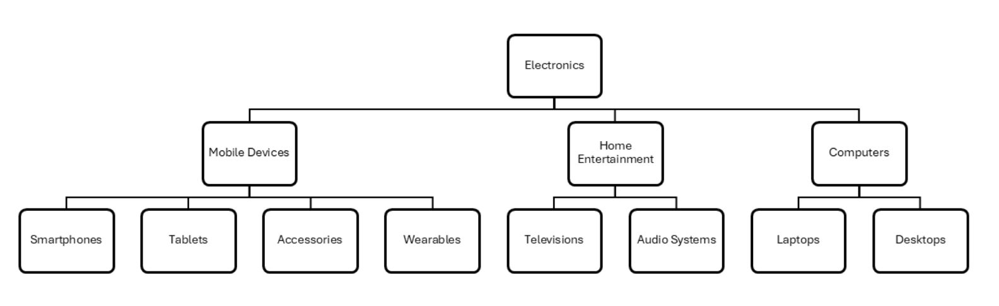

**摘要**：在本教程中，你将学习如何使用 `PostgreSQL` 递归 `CTE` 来查询层次结构数据，例如组织结构图和类别树。

# `PostgreSQL` 递归 `CTE` 入门

公用表表达式（ `CTE` ）提供了一种在查询中定义临时表的方法。递归公用表表达式是公用表表达式的一种类型，它会在其公用表表达式查询定义中引用自身。

> 在编程中，递归函数是一种会调用自身直到不再调用的函数。同样地，递归公用表表达式（ `CTE` ）是在 `CTE` 查询中引用自身的 `CTE` 。

递归CTE有两个主要部分：

- **Anchor member** 是提供基础结果集的查询。
- **Recursive member** 是引用公用表表达式（ `CTE` ）自身的查询。它会重复执行并构建最终的结果集。递归成员具有终止条件，当它不返回任何行时，执行就会停止。

递归 `CTE` 使用 `UNION` 或 `UNION ALL` 来合并由锚点成员和递归成员返回的结果集。

以下是递归 `CTE` 的语法：

```sql
WITH RECURSIVE cte_name (column1, column2, ...) AS (
    -- Anchor member
    SELECT ...
    UNION ALL
    -- Recursive member
    SELECT ...
    FROM cte_name
    WHERE ...
)
SELECT *
FROM cte_name;
```

在以下语法中：

- `WITH RECURSIVE` 关键字用于定义一个具有名称（ `cte_name` ）的递归 `CTE` 。
- `An anchor` 成员构成基本结果集。
- 递归成员获取基本结果集并开始递归，直到它不返回任何行。
- `UNION`（或 `UNION ALL` ）运算符将锚点成员和递归成员的结果集合并为最终结果集。

# `PostgreSQL` 递归 `CTE` 示例

以下示例使用递归 `CTE` 生成从 `3` 到 `1` 的倒计时：

```sql
WITH RECURSIVE count_down (counter) AS (
    -- Anchor member
    SELECT  3 AS counter
    UNION
    -- Recursive member
    SELECT counter - 1
    FROM count_down
    WHERE counter > 1
  )
SELECT * FROM count_down;
```

以下是对该查询的详细分析：

首先，锚点成员将计数器初始化为3（第一次迭代）：

```sql
SELECT 3 AS counter
```

`anchor member` 锚点成员形成一个基本结果集：

```sql
 counter
---------
       3
```

其次，递归成员从基础结果集开始，并将计数器减1：

```sql
SELECT counter - 1
FROM count_down
WHERE counter > 1
```

第二次迭代后，结果集将是：

```sql
 counter
---------
       2
```

第三次迭代后，计数器为1：

```sql
 counter
---------
       1
```

当计数器为1时，它将停止锚点成员。`UNION` 运算符会合并所有迭代的结果集：

```sql
 counter
---------
       3
       2
       1
```

第三，主查询从 `count_down` 公用表表达式（ `CTE` ）中检索所有值：

```sql
SELECT * FROM count_down;
```

# 使用递归 `CTE` 查询产品类别

假设我们有以下按树形结构组织的产品类别：



以下是表结构：

```sql
CREATE TABLE IF NOT EXISTS categories (
  category_id INT GENERATED BY DEFAULT AS IDENTITY PRIMARY KEY,
  category_name VARCHAR(255) NOT NULL UNIQUE,
  parent_id INT,
  FOREIGN KEY (parent_id) REFERENCES categories (category_id) ON DELETE CASCADE
);
```

以下语句使用递归 `CTE` 查询所有类别及其深度：

```sql
WITH RECURSIVE category_hierarchy AS (
    SELECT category_id, category_name, parent_id,  0 AS depth
    FROM categories
    WHERE parent_id IS NULL
    UNION ALL
    SELECT c.category_id, c.category_name, c.parent_id, s.depth + 1
    FROM categories c
    INNER JOIN category_hierarchy s ON c.parent_id = s.category_id
)
SELECT * FROM category_hierarchy;
```

输出：

```sql
 category_id |   category_name    | parent_id | depth
-------------+--------------------+-----------+-------
           1 | Electronics        |      NULL |     0
           2 | Mobile Devices     |         1 |     1
           7 | Home Entertainment |         1 |     1
          10 | Computers          |         1 |     1
           3 | Smartphones        |         2 |     2
           4 | Tablets            |         2 |     2
           5 | Accessories        |         2 |     2
           6 | Wearables          |         2 |     2
           8 | Televisions        |         7 |     2
           9 | Audio Systems      |         7 |     2
          11 | Laptops            |        10 |     2
          12 | Desktops           |        10 |     2
```

工作原理。

首先，锚成员返回顶部类别，其中 `parent_id` 是 `NULL` 与深度 `0` ：

```sql
SELECT category_id, category_name, parent_id,  0 AS depth
FROM categories
WHERE parent_id IS NULL
```

其次，递归成员会返回 `depth + 1` 处的类别，直到没有可提取的行为止： 

```sql
SELECT c.category_id, c.category_name, c.parent_id, s.depth + 1
FROM categories c
INNER JOIN category_hierarchy s ON c.parent_id = s.category_id
```

第三，`UNION` 运算符合并所有迭代的结果集。

最后，外部查询从公用表表达式（ `CTE` ）中检索数据：

```sql
SELECT * FROM category_hierarchy;
```

# 总结

- 递归公用表表达式包含一个引用自身的递归成员。
- 使用递归公用表表达式（ `CTE` ）查询层级数据。