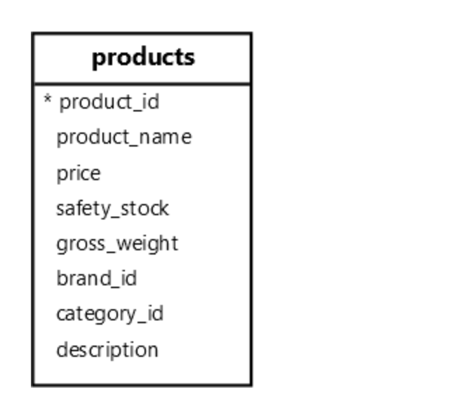

**摘要**：在本教程中，您将探索 `PostgreSQL` 全文搜索功能以及如何在数据库中实现它。

# `PostgreSQL` 全文搜索简介

到目前为止，您已经学会了如何使用带有相等运算符 （ `=` ） 的 `WHERE` 子句准确查找文本：

```sql
SELECT
  column1,
  column2
FROM
  table_name
WHERE
  column_name = 'search_term';
```

并使用 `LIKE` 运算符根据指定的模式匹配文本：

```sql
SELECT
  column1,
  column2
FROM
  table_name
WHERE
  column_name LIKE pattern;
```

如果完全匹配和模式匹配还不够，您可以使用正则表达式或使用 `SIMILAR TO` 运算符：

```sql
SELECT
  column1,
  column2
FROM
  table_name
WHERE
  column1 SIMILAR TO pattern;
```

如果这些选项不符合您的要求，您可以使用全文搜索。

在 `PostgreSQL` 中，全文搜索是一项强大的功能，允许您对文本进行复杂的搜索。它通过索引基于文本的数据的单词和短语来有效地搜索和排名。

例如，如果找到包含单词 `advance` 的文档，则全文搜索将返回包含单词 `advance` `advancing`和 `advanced` 的文档。

文档是要在全文搜索中搜索的基本文本单位。它可以是表的列，也可以是多个表的列的组合。

# `PostgreSQL` 全文搜索数据类型

`PostgreSQL` 提供了两种特定的数据类型来支持全文搜索：`tsvector` 和 `tsquery` 。

# `tsvector` 数据类型

`tsvector` 是一种支持全文搜索的数据类型。它表示通过存储不同规范化单词的排序列表来优化文本搜索的文档。

规范化词的技术术语是词位。词位是没有变体的单词，例如 `teaches` 和 `teaching words` 具有词位 `teach`

要将常规字符串转换为 `tsvector`，请使用 `to_tsvector` 函数。例如：

```sql
SELECT
  to_tsvector('teaches'),
  to_tsvector('teaching');
```

输出：

```sql
 to_tsvector | to_tsvector
-------------+-------------
 'teach':1   | 'teach':1
```

在此示例中，`to_tsvector` 函数将单词 `teaches` 和 `teaching` 转换为单词 `teach。`

`tsvector` 数据类型具有以下特点：

- 词位：规范化单词以将其变体合并为同一个单词。
- 排序和重复数据删除：自动对词位进行排序并删除重复项，然后再将它们存储在表格中。
- 位置信息：添加文档中词位的位置，然后将它们用于邻近排名。
- 权重：`PostgreSQL` 允许您使用权重（`A`、`B`、`C` 或 `D`）标记词位，以强调它们的重要性。

例如，以下语句使用 `to_tsvector` 将文本解析为标记，将它们简化为词位，并返回 `tsvector`：

```sql
SELECT
  to_tsvector(
    'The big blue elephant jumps over the lazy dog. The big blue elephant is very big'
  );
```

输出：

```sql
                           to_tsvector
------------------------------------------------------------------
 'big':2,11,16 'blue':3,12 'dog':9 'eleph':4,13 'jump':5 'lazi':8
```

解释：

- **Lexemes**：该函数将 `elephant` 等单词归一化为 `eleph` ， `jumps` 变成 `jump` ，并删除 `The` 和 `is` 等停用词。
- 排序和重复数据删除：该函数按字母顺序对词位进行排序。
- 位置信息：该函数添加文档中每个词位的位置。例如，`big` 一词出现在位置 `2` 、 `11` 和 `16` 。

> 要将权重设置为词位，您可以使用 `setweight` 函数，该函数在本教程的范围内。

# `tsquery` 数据类型

`PostgreSQL` 使用 `tsquery` 数据类型来表示全文搜索查询。

`tsquery` 支持以下主要功能：

- 布尔运算符：`tsquery` 支持逻辑运算符 `AND` （ `&` ）、`OR` （ `|` ） 和 `NOT` （ `!` ）。例如，您可以使用布尔运算符搜索包含单词 `elephant` 和 `blue` 但不包含 `dolphin` 的文档。
- 短语搜索：使用双引号（ `''` ）确保封闭的单词必须以相同的顺序一起出现在文档中。例如，搜索词 `big elephant` 、短语 `big elephant` 必须作为一个整体出现在文档中。
- 分组：`tsquery` 使用括号 () 对术语和运算符进行分组，允许您形成灵活的搜索条件。

例如，下面显示了 `tsquery` 表示的文本字符串：

```sql
"blue" & "elephant" |"dolphin"
```

此 `tsquery` 形成一个查询，用于搜索包含单词 `blue` 和 `elephant` 或 `dolphin` 的文档。

要将字符串转换为 `tsquery` 值，请使用 `to_tsquery` 函数。例如：

```sql
SELECT to_tsquery('"blue" & "elephant" |"dolphin"');
```

输出：

```sql
          to_tsquery
------------------------------
 'blue' & 'eleph' | 'dolphin'
```

# 匹配运算符 （@@）

`PostgreSQL` 使用匹配运算符 `(@@）` 将 `tsvector` 与 `tsquery` 进行匹配，以确定 `tsvector` 表示的文本是否包含 `tsquery` 中指定的术语：

```sql
tsvector @@ tsquery
```

例如：

```sql
SELECT
  to_tsvector('The big blue elephant jumps over the lazy dog.') @@ to_tsquery('elephant') result;
```

输出：

```sql
 result
--------
 t
```

可以将 `CHARVARCHAR` 和 `TEXT` 值与匹配运算符一起使用：

```sql
text @@ tsquery
```

在这种情况下，`PostgreSQL` 将在与 `tsquery` 匹配之前隐式地将文本转换为 `tsvector` 。

# `PostgreSQL` 全文搜索示例

让我们探讨一些使用 `PostgreSQL` 全文搜索和 `products` 表的 `description` 列的示例：



# 0） 创建 `GIN` 索引

`PostgreSQL` 提供了专门为全文搜索设计的 `GIN` 索引。`GIN` 代表广义倒挂指数。

我们将为 `products` 表的 `description` 列创建 `GIN` 索引，以启用全文搜索。

```sql
CREATE INDEX fts_products_description
ON products
USING GIN ((to_tsvector('english', description)));
```

# 1） 执行基本的全文搜索

以下示例搜索描述包含单词 power 及其变体（例如 `powerful` ）的产品：

```sql
SELECT
  product_name,
  description
FROM
  products
WHERE
  description @@ to_tsquery('power');
```

# 2） 使用 `AND` 运算符执行全文搜索

以下语句使用 `AND` 运算符 （ `&` ） 搜索描述中同时包含 "powerful" 和 "advanced" 一词的产品：

```sql
SELECT
  product_name,
  description
FROM
  products
WHERE
  description @@ to_tsquery('power & large');
```

# 3） 使用 `OR` 运算符执行全文搜索

以下语句使用 `OR` 运算符 （ `|` ） 搜索描述包含 "large" 或 "great" 一词的产品：

```sql
SELECT
  product_name,
  description
FROM
  products
WHERE
  description @@ to_tsquery('large|great');
```

# 4） 执行短语搜索

以下语句搜索描述包含短语 "sleek design" 的产品：

```sql
SELECT
  product_name,
  description
FROM
  products
WHERE
  description @@ to_tsquery('''sleek design''');
```

# 5） 使用 `NOT` 运算符执行全文搜索


以下语句使用 `NOT` 运算符 （ `!` ） 搜索描述不包含 "功能" 一词的产品：

```sql
SELECT
  product_name,
  description
FROM
  products
WHERE
  description @@ to_tsquery('!features');
```

# 总结

- 使用 `PostgreSQL` 全文搜索对存储在数据库中的文本执行复杂搜索。
- 使用 `tsvector` 数据类型存储文档以进行全文搜索。
- 使用 `tsquery` 数据类型存储全文搜索查询。
- 使用匹配运算符 （ `@@` ） 将 `tsquery` 与之匹配，以检查 `tsvector` 表示的文本是否包含 `tsquery` 中指定的术语。
- 使用 `GIN` 索引为全文搜索的列编制索引。

