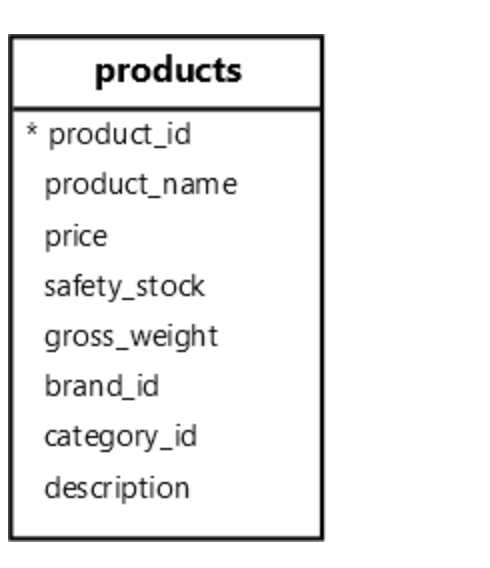

**摘要**：在本教程中，您将学习如何使用 `PostgreSQL LIKE` 运算符在列中搜索指定的模式。

# `PostgreSQL LIKE` 运算符入门

`PostgreSQL LIKE` 运算符允许您在列中搜索指定的模式。可以在 `WHERE` 子句中使用 `LIKE` 运算符根据模式过滤行。

下面是 `LIKE` 运算符的语法：

```sql
SELECT
  column1, column2
FROM
  table_name
WHERE
  column1 LIKE pattern;
```

# 通配符

通常，使用以下通配符来构造模式：

- `%` 表示任何零个或多个字符。
- `_` 表示任何单个字符。

# `PostgreSQL LIKE` 运算符示例

让我们探讨一下将 `LIKE` 运算符与 `products` 表一起使用的示例：



# 查找名称以"三星"开头的产品

以下查询使用 `LIKE` 运算符查找名称以 "Samsung" 开头的产品：

```sql
SELECT
  product_name,
  price
FROM
  products
WHERE
  product_name LIKE 'Samsung%';
```

输出：

```sql
       product_name        |  price
---------------------------+---------
 Samsung Galaxy S24        |  999.99
 Samsung Galaxy Z Fold 5   | 1799.99
 Samsung Galaxy Tab S9     |  699.99
 Samsung Galaxy Buds Pro 2 |  199.99
 Samsung Galaxy Watch 6    |  349.99
 Samsung QN900C Neo QLED   | 2999.99
```

图案 "Samsung%" 匹配名称以 "Samsung" 一词开头的产品。

# 查找名称以 "5" 结尾的产品

以下语句使用 `LIKE` 运算符查找名称以字符串 "5" 结尾的产品：

```sql
SELECT
  product_name,
  price
FROM
  products
WHERE
  product_name LIKE '%5';
```

输出：

```sql
        product_name        |  price
----------------------------+---------
 Apple iPhone 15            | 1099.99
 Samsung Galaxy Z Fold 5    | 1799.99
 Dell XPS 15                | 1499.99
 Microsoft Surface Laptop 5 | 1299.99
```

# 查找名称中任意位置带有 `Pro` 的产品

以下查询使用 `LIKE` 运算符查找名称包含 `Pro` 的所有产品：

```sql
SELECT
  product_name,
  price
FROM
  products
WHERE
  product_name LIKE '%Pro%';
```

输出：

```sql
       product_name        |  price
---------------------------+---------
 Apple iPhone 15 Pro Max   | 1299.99
 Apple iPad Pro 12.9       | 1099.99
 Apple AirPods Pro 3       |  249.99
 Samsung Galaxy Buds Pro 2 |  199.99
```

# 查找名称恰好包含 `10` 个字符的产品

以下 `SELECT` 语句使用 `LIKE` 运算符查找名称恰好包含 `10` 个字符的产品：

```sql
SELECT
  product_name,
  price
FROM
  products
WHERE
  product_name LIKE '_ _ _ _ _ _ _ _ _ _';
```

输出：

```sql
 product_name |  price
--------------+---------
 LG G3 OLED   | 2499.99
```

在此示例中，每个下划线 `_` 表示一个字符。

# 使用 `ILIKE` 运算符进行不区分大小写的搜索

`PostgreSQL` 提供了 `ILIKE` 运算符，它类似于 `LIKE` ，但匹配模式不区分大小写。

例如，以下语句使用 `ILIKE` 运算符查找名称带有字母 `B` 或 `b` 的所有产品：

```sql
SELECT
  product_name,
  price
FROM
  products
WHERE
  product_name ILIKE '%b%';
```

输出：

```sql
       product_name        |  price
---------------------------+---------
 Samsung Galaxy Tab S9     |  699.99
 Samsung Galaxy Buds Pro 2 |  199.99
 Sony Bravia XR A95K       | 2499.99
 Sony HT-A7000 Soundbar    | 1299.99
 Bose SoundLink Max        |  399.99
 Lenovo ThinkPad X1 Carbon | 1599.99
```

# 用 `NOT` 运算符否定 `LIKE` 运算符

`NOT` 运算符否定 `LIKE` 和 `ILIKE` 运算符的结果：

```sql
SELECT select_list
FROM table_name
WHERE column1 NOT LIKE pattern;

SELECT select_list
FROM table_name
WHERE column1 NOT ILIKE pattern;
```

例如，以下语句使用 `NOT LIKE` 运算符查找名称不包含字母 `a` 或 `A` 的产品：

```sql
SELECT
  product_name
FROM
  products
WHERE
  product_name NOT ILIKE '%a%';
```

输出：

```sql
   product_name
------------------
 LG OLED TV C3
 LG G3 OLED
 Dell XPS 15
 HP Spectre x360
 Dell Inspiron 27
```

# 运算符

`PostgreSQL` 提供了一些运算符，这些运算符复制了 `LIKE ILIKE` 和 `NOT ILIKE` 运算符的功能。 `NOT LIKE`

| Operator | Meaning |
|:----:|:----:|
| ~~ | LIKE |
| ~~* | ILIKE |
| !~~ | NOT LIKE |
| !~~* | NOT ILIKE |

例如：

```sql
SELECT
  product_name
FROM
  products
WHERE
  product_name ~~ '%3%';
```

输出：

```sql
    product_name
---------------------
 Apple AirPods Pro 3
 LG OLED TV C3
 LG G3 OLED
 HP Spectre x360
```

# 转义字符

您要查找的字符串可能包含通配符 `%` 和 `_` ，例如 `100%` 。

要将通配符视为常规字符，可以在 `LIKE` 和 `ILIKE` 运算符中使用 `ESCAPE` 选项：

```sql
SELECT
  column1,
  column2
FROM
  table_name
WHERE
  column1 LIKE pattern ESCAPE escape_character;
```

例如，以下语句使用 `LIKE` 运算符查找描述包含 `100%` 的产品：

```sql
SELECT
  product_name,
  description
FROM
  products
WHERE
  description LIKE '%100$%%' ESCAPE '$';
```

在此示例中，我们使用 `$` 字符作为转义字符。我们在 `%` 之前指定转义字符 `$` ，因此 `LIKE` 运算符将紧跟 `100` 之后的字符 `%` 视为常规字符。

# 将 `LIKE` 与 `CASE` 表达式一起使用

下面演示如何使用 `CASE` 表达式中的 `LIKE` 运算符从 `products` 表中检索 `iPhone` 和 `Galaxy` 组：

```sql
SELECT
  product_name,
  CASE
    WHEN product_name LIKE '%iPhone%' THEN 'iPhone'
    WHEN product_name LIKE '%Galaxy%' THEN 'Galaxy'
  END AS group,
  price
FROM
  products
WHERE
  product_name like '%iPhone%'
  OR product_name like '%Galaxy%'
ORDER BY
  product_name;
```

输出：

```sql
       product_name        | group  |  price
---------------------------+--------+---------
 Apple iPhone 15           | iPhone | 1099.99
 Apple iPhone 15 Pro Max   | iPhone | 1299.99
 Samsung Galaxy Buds Pro 2 | Galaxy |  199.99
 Samsung Galaxy S24        | Galaxy |  999.99
 Samsung Galaxy Tab S9     | Galaxy |  699.99
 Samsung Galaxy Watch 6    | Galaxy |  349.99
 Samsung Galaxy Z Fold 5   | Galaxy | 1799.99
```

在此示例中：

- `WHERE` 筛选行以仅包含名称包含 `iPhone` 或 `Galaxy` 的产品。
- `CASE` 表达式根据 `product_name` 的值创建一个名为 `group` 的新列。

如果产品名称包含 `iPhone` 或 `Galaxy` ，则 `group` 列将分别具有 `iPhone` 或`Galaxy`。

# 总结

- 使用 `LIKE` 运算符匹配列中的指定模式。
- 使用 `%` 通配符表示零个或多个字符，使用 `_` 通配符表示单个字符。
- 使用 `ILIKE` 运算符不区分大小写来匹配指定的模式。
- 使用 `NOT` 运算符否定 `LIKE` 和 `ILIKE` 运算符。
- 使用 `ESCAPE` 将通配符视为常规字符。