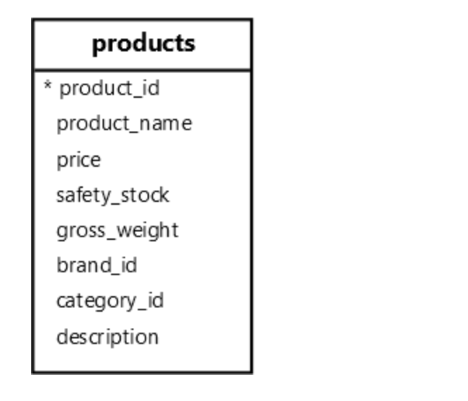

**摘要**：在本教程中，您将学习如何使用 `PostgreSQL` 正则表达式来匹配文本字符串。

# `POSIX` 正则表达式简介

正则表达式正则表达式是定义搜索模式的字符序列。

例如，`\d+` 正则表达式匹配一个或多个数字。它们可以是任何数字，而不是特定于特定数字。字符串 `iPhone 15` 将匹配正则表达式 `\d` 。

`PostgreSQL` 支持 `POSIX` 正则表达式，这是由 `POSIX`（可移植作系统接口）定义的一组标准化正则表达式。

> `Perl` 兼容正则表达式 （ `PCRE` ） 是 POSIX 正则表达式之外的另一个标准。`PostgreSQL` 本身不支持 `PCRE` 正则表达式。

让我们了解 `POSIX` 正则表达式的工作原理。

# Character Classes

- `\d` 匹配任何数字。相当于 `[0-9]`
- `\s` 匹配任何空格字符。
- `\w` 匹配任何单词字符，包括字母、数字和下划线。它相当于 `[a-zA-Z0-9_]`
- 大写字母否定了字符类的含义：
- `\D` 匹配任何非数字字符，相当于 `[^0-9]`
- `\S` 匹配任何非空格字符。
- `\W` 匹配任何非单词字符。

# Anchors

锚点匹配位置而不是字符：

- `^` 匹配字符串的开头。
- `$` 匹配字符串的末尾。

# Quantifiers

量词匹配字符集的实例数：

- `*` 匹配零个或多个。
- `+` 匹配一个或多个。
- `?` 匹配 `0` 或 `1`。
- `{n}` 恰好匹配 `n` 次。
- `{n,}` 至少匹配 `n` 次。
- `{n,m}` 匹配 `n` 到 `m` 次的范围，其中 `n < m` 。

# Sets & Ranges

使用 `[]` 创建与集合中任何字符匹配的集合。例如，`[abc]` 匹配 `a`、`b` 或 `c`。

使用连字符 `-` 在方括号 `[]` 内创建范围。例如，`[a-z]` 是从 `a` 到 `z` 的字符范围。`[0-9]` 是从 `0` 到 `9` 的数字范围。

在 `[]` 中使用 `^` 来排除集合或范围。例如，集合 `[^0-9]` 匹配除数字之外的任何字符。

# Alternation

使用 `|` 表示交替，类似于 `OR` 运算符。例如，正则表达式 `a|b` 与 `a` 或 `b` 匹配。

# `PostgreSQL` 正则表达式运算符

`PostgreSQL` 允许您将 `POSIX` 正则表达式与以下运算符一起使用：

- `~` 匹配模式。
- `~*` 不区分大小写匹配模式。
- `!~` 与模式不匹配。
- `!~*` 不区分大小写不匹配模式。

# `PostgreSQL` 正则表达式示例

让我们探讨一下在 `products` 表中使用正则表达式的一些示例：



# 匹配字符类

以下查询使用匹配运算符 `（~）` 查找名称包含三位数字的产品：

```sql
SELECT
  product_name
FROM
  products
WHERE
  product_name ~ '\d{3}';
```

输出:

```sql
      product_name
-------------------------
 Samsung QN900C Neo QLED
 Sony HT-A7000 Soundbar
 HP Spectre x360
```

以下查询使用匹配运算符 （`~`） 查找名称包含字母 S 后跟两位数字的产品：

```sql
SELECT
  product_name
FROM
  products
WHERE
  product_name ~ 'S\d{2}';
```

输出：

```sql
    product_name
--------------------
 Samsung Galaxy S24
```

# 匹配位置

以下语句使用匹配运算符 （`~`） 查找名称以字母 `H` 开头的产品：

```sql
SELECT
  product_name
FROM
  products
WHERE
  product_name ~ '^H';
```

输出：

```sql
  product_name
-----------------
 Huawei Mate 60
 HP Spectre x360
```

以下查询使用匹配运算符 （`~`） 查找名称以两位数字结尾的产品：

```sql
SELECT
  product_name
FROM
  products
WHERE
  product_name ~ '\d{2}$';
```

输出：

```sql
    product_name
--------------------
 Samsung Galaxy S24
 Apple iPhone 15
 Huawei Mate 60
 Xiaomi Mi 14
 Dell XPS 15
 HP Spectre x360
 Dell Inspiron 27
```

# 匹配 `iPhone` 或 `Galaxy`

以下查询使用匹配运算符 （`~`） 查找名称包含 `iPhone` 或 `Galaxy` 的产品：

```sql
SELECT
  product_name
FROM
  products
WHERE
  product_name ~ 'iPhone|Galaxy';
```

输出：

```sql
       product_name
---------------------------
 Samsung Galaxy S24
 Apple iPhone 15
 Samsung Galaxy Z Fold 5
 Apple iPhone 15 Pro Max
 Samsung Galaxy Tab S9
 Samsung Galaxy Buds Pro 2
 Samsung Galaxy Watch 6
```

要不区分大小写来匹配 `iPhone` 和 `Galaxy` ，您可以使用 `~*` 运算符：

```sql
SELECT
  product_name
FROM
  products
WHERE
  product_name ~* 'iphone|galaxy';
```

输出：

```sql
       product_name
---------------------------
 Samsung Galaxy S24
 Apple iPhone 15
 Samsung Galaxy Z Fold 5
 Apple iPhone 15 Pro Max
 Samsung Galaxy Tab S9
 Samsung Galaxy Buds Pro 2
 Samsung Galaxy Watch 6
```

# 查找与模式不匹配的产品名称

以下查询使用运算符 （ `!~` ） 查找名称不包含数字的产品：

```sql
SELECT
  product_name
FROM
  products
WHERE
  product_name !~ '\d+';
```

输出：

```sql
    product_name
--------------------
 Bose SoundLink Max
```

# 总结

- `PostgreSQL` 支持 `POSIX` 正则表达式。
- 使用正则表达式运算符将字符串与模式进行匹配。