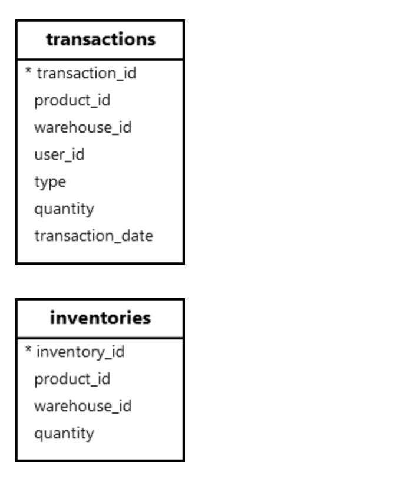

**摘要**：在本教程中，您将学习如何使用 `PostgreSQL CREATE PROCEDURE PROCEDURE` 语句创建新的存储过程。

# `PostgreSQL CREATE PROCEDURE` 语句简介

存储过程是在 `PostgreSQL` 数据库服务器上存储和执行的一组预编译的 `SQL` 语句。

要定义存储过程，请使用具有以下语法的 `CREATE PROCEUDRE` 语句：

```sql
CREATE OR REPLACE PROCEDURE procedure_name(parameter_list) 
AS
$$
-- body of the stored procedure
$$
LANGUAGE SQL;
```

在此语法中：

- `CREATE PROCEDURE` 定义新的存储过程。
- `OR REPLACE` 替换现有存储过程（如果存在）。
- `procedure_name` ：指定存储过程的名称。
- `parameter_list` ：存储过程的参数列表。
- `AS` 指示存储过程正文的开始。
- `$` ：包含构成存储过程正文的代码。
- `LANGUAGE SQL` ：指定存储过程的语言为 `SQL`。您还可以使用其他过程语言，例如 `PL/pgSQL`。

如果要执行多个 `SQL` 语句，请将它们放在 `BEGIN ATOMIC ... END` 块：

```sql
CREATE OR REPLACE PROCEDURE procedure_name(parameter_list) 
LANGUAGE SQL
BEGIN ATOMIC
    sql_statement1;
    sql_statement2;
END;
```

在此语法中，`BEGIN ATOMIC ... END` 块确保块中的所有 `SQL` 语句（`sql_statement1`、`sql_staetment2` 等）都成功，或者没有一个成功。换句话说，它将作为单个原子单元执行所有语句。

# 基本 `PostgreSQL CREATE PROCEDURE` 语句示例

以下示例使用 `CREATE PROCEDURE` 语句定义一个新的存储过程 `update_safety_stock` ，用于更新由产品 `ID` 指定的产品的安全库存：

```sql
CREATE OR REPLACE PROCEDURE update_safety_stock(
    id INT, 
    new_safety_stock INT
)
AS
$$
    UPDATE products
    SET safety_stock = new_safety_stock
    WHERE product_id = id;
$$
LANGUAGE SQL;
```

# 调用 `PostgreSQL` 存储过程

要执行 `PostgreSQL` 存储过程，请使用具有以下语法的 `CALL` 语句：

```sql
CALL procedure_name(arguments);
```

例如，要更新产品 `ID` `1` 到 `20` 的安全库存：

```sql
CALL update_safety_stock(1, 20);
```

要验证更新，请从 `products` 表中检索数据：

```sql
SELECT
  product_id,
  safety_stock
FROM
  products
WHERE
  product_id = 1;
```

输出：

```sql
 product_id | safety_stock
------------+--------------
          1 |           20
```

# 创建执行多个语句的存储过程

我们将使用 `transactions` 和 `inventories` 表：



首先，定义一个名为 `update_inventory` 的存储过程，用于更新事务和清单：

```sql
CREATE OR REPLACE PROCEDURE update_inventory(
    p_id INT,
    w_id INT,
    u_id INT,
    type transaction_type,
    qty INT
)
LANGUAGE SQL
BEGIN ATOMIC
    INSERT INTO transactions (product_id, warehouse_id, user_id, type, quantity, transaction_date)
    VALUES (p_id, w_id, u_id, type, qty, CURRENT_DATE);

    UPDATE inventories
    SET quantity = CASE type 
        WHEN 'receipt' THEN quantity + qty 
        WHEN 'issue' THEN quantity - qty 
        END
    WHERE product_id = p_id AND 
          warehouse_id = w_id;
END;
```

然后，尝试通过调用 `update_inventory` 存储过程从仓库 `1` 发放 `10000` 个 `id` 为 `1` 的产品：

```sql
CALL update_inventory(1, 1, 1, 'issue', 10000);
```

如果 `PostgreSQL` 发出以下错误：

```sql
new row for relation "inventories" violates check constraint "inventories_quantity_check"
```

原因是库存不足。`UPDATE` 语句导致了 `CHECK` 约束冲突。由于 `UPDATE` 语句失败，因此 `INSERT` 和 `UPDATE` 语句也失败。

接下来，从仓库 `1` 中发放 `10` 个 `ID` 为 `1` 的产品：

```sql
CALL update_inventory(1, 1, 1, 'issue', 10);
```

最后，通过查询 `transactions` 和 `inventories` 表中的数据来验证库存：

查询 `transactions` 表：

```sql
SELECT
  type,
  quantity
FROM
  transactions
WHERE
  product_id = 1
  AND warehouse_id = 1
  AND type = 'issue'
  AND transaction_date = CURRENT_DATE;
```

输出:

```sql
 type  | quantity
-------+----------
 issue |       10
```

查询 `inventories` 表：

```sql
SELECT
  quantity
FROM
  inventories
WHERE
  product_id = 1
  AND warehouse_id = 1;
```

输出：

```sql
 quantity
----------
       90
```

# 总结

- 使用 `CREATE PROCEDURE` 语句创建新的存储过程。