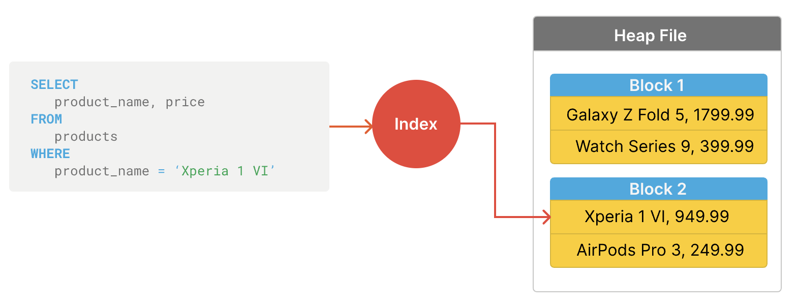

**摘要**：在本教程中，您将学习如何使用 `PostgreSQL` 索引来提高查询性能。

# `PostgreSQL` 存储数据的位置

首先，使用 `psql` 连接到本地 `PostgreSQL` 上的 `inventory` 数据库：

```sql
psql -U postgres -d inventory
```

它将提示您输入用户 `postgres` 的密码。

其次，使用以下 `SHOW` 命令显示数据目录的位置：

```sql
SHOW data_directory;
```

如果您使用 `Windows` ，您将看到如下所示的输出：

```sql
           data_directory
-------------------------------------
 C:/Program Files/PostgreSQL/17/data
```

> 如果您使用 `macOS` 或 `Linux` ，您将看到不同的路径。此外，如果您不使用 `PostgreSQL 17` ，您将在返回的路径中获得不同的版本号 (`17`) 。

数据目录是 `PostgreSQL` 存储数据库文件、配置和日志的目录。

第三，查看 `base` 目录的目录： 

```sql
C:/Program Files/PostgreSQL/17/data/base/
```

将有一些名称为数字的目录。每个目录代表 `PostgreSQL` 服务器中的一个数据库。

第四，检索 `oid` 和数据库名称：

```sql
SELECT
  oid,
  datname
FROM
  pg_database;
```

输出：

```sql
  oid  |    datname
-------+----------------
     5 | postgres
     1 | template1
     4 | template0
 46769 | inventory
...
```

`oid`（对象标识符）是 `PostgreSQL` 分配给数据库对象（例如数据库或表）的唯一标识符。

`oid` 46769 对应于存储 `inventory` 数据库数据的目录。

第五，在 `inventory` 数据库中找到表的 `oid` ：

```sql
SELECT
  c.oid,
  c.relname
FROM
  pg_class c
  JOIN pg_namespace n ON n.oid = c.relnamespace
WHERE
  c.relkind = 'r'
  AND n.nspname NOT IN ('pg_catalog', 'information_schema');
```

输出：

```sql
  oid  |      relname
-------+-------------------
 46908 | users
 46917 | profiles
 46936 | categories
 46928 | brands
 46949 | products
 46977 | product_tags
 46970 | tags
 46999 | inventories
 46993 | warehouses
 47022 | transactions
 47429 | product_groups  
```

# `PostgreSQL` 如何存储数据

`PostgreSQL` 使用堆文件存储模型存储表的数据。每个表对应于一个 `heap file`。

例如，`PostgreSQL` 将 `products` 表的数据存储在名为 `46949` 的堆文件中。您可以在数据库目录中找到这些文件：

```sql
C:/Program Files/PostgreSQL/17/data/base/46949/
```

每个堆文件由 `blocks`（或 `pages`）组成。通常，默认情况下，块的大小为 `8KB` 。每个块包含多个元组（或行）。

此外，`PostgreSQL` 还维护其他信息，用于确定哪些行可以访问。

# `Full table scan`

从表中检索数据时，`PostgreSQL` 必须从堆文件中读取数据并将其加载到内存中以过滤行。

全表扫描意味着 `PostgreSQL` 必须将堆文件（表）中的所有行读取到内存并搜索行。

大多数时候，全表扫描效率不高，因为 `PostgreSQL` 必须读取每个块，即使只有几行符合条件。

# `PostgreSQL` 索引简介

索引是一种单独的数据结构，允许 `PostgreSQL` 在不扫描表的情况下快速定位行。

> 索引类似于书中的索引，它使您无需阅读每一页即可快速查找信息。

以下是创建索引的方法：

- **步骤 1**. 确定要快速查找的一个或多个列。
- **步骤 2**. 从指定的列和每个列的相应块中提取数据。
- **步骤 3**. 对数据进行排序。例如，按字母顺序对文本数据进行排序，数字从低到高等。
- **步骤 4**. 将数据组织成 B 树结构，从左到右将数据均匀分布在叶节点中。
- **步骤 5**. 使用索引查找确切的行。

我们将创建一个索引来加速以下查询：

```sql
SELECT
  product_name,
  price
FROM
  products
WHERE
  product_name = 'Xperia 1 VI';
```

**步骤 1**. 我们希望在 `products` 表上快速查找的列是 `product_name`：



**步骤 2**. 从 `product_name` 列中提取数据。假设表有四行，产品名称如下：

- Galaxy Z Fold 5
- AirPods Pro 3
- Xperia 1 VI
- Watch Series 9


**步骤 3**. 对数据进行排序。例如，按字母顺序对文本数据进行排序，数字从低到高等。


**步骤 4**. 在 `B-tree` 数据结构中组织数据以实现快速查找。


**步骤 5**. 在搜索名为 `Xperia 1 VI` 的产品时，`PostgreSQL` 会从根节点开始，转到右侧的叶节点，找到块 `#2` 和索引 `#1` 。

`PostgreSQL` 可以直接从块 `#2` 和索引 `#1` 中读取行，而不是从堆文件加载所有块。

# `CREATE INDEX` 语句

要在 `PostgreSQL` 中创建索引，请使用 `CREATE INDEX` 语句：

```sql
CREATE INDEX [index_name] 
ON table_name (column1, column2);
```

在此语法中：

- 首先，为索引指定可选名称。如果省略它，`PostgreSQL` 会自动生成一个具有命名约定 `table_column_idx` 的名称。
- 其次，提供表名，后跟要快速查找的一个或多个列。

例如，以下 `CREATE INDEX` 语句在 `products` 表的 `product_name` 列上创建一个索引：

```sql
CREATE INDEX ON products(product_name);
```

`CREATE INDEX` 语句执行以下作：

- 首先，从 `product_name` 列中提取值。
- 其次，按字母顺序对它们进行排序。
- 第三，将其作为单独的数据结构存储在磁盘上。

当您按产品名称查找产品时，`PostgreSQL` 有一个称为查询优化器的特定软件组件，用于决定是否应该使用索引或执行全表扫描。

如果行数相对较少，查询优化器将执行全表扫描，因为它比读取索引和查找数据更有效。

# 基准测试查询

要检查查询是否执行全表扫描或使用索引，您可以在查询之前使用 `EXPLAIN ANALYZE` 关键字：

```sql
EXPLAIN ANALYZE query;
```

`EXPLAIN ANALYZE` 返回查询的计划执行时间和实际执行时间。

例如，以下语句返回查找名称为 `Xperia 1 VI` 的产品的查询的计划和实际执行时间：

```sql
EXPLAIN ANALYZE
SELECT
  product_name,
  price
FROM
  products
WHERE
  product_name = 'Xperia 1 VI';
```

输出：

```sql
                                             QUERY PLAN
----------------------------------------------------------------------------------------------------
 Seq Scan on products  (cost=0.00..25.83 rows=1 width=17) (actual time=0.035..0.036 rows=0 loops=1)
   Filter: ((product_name)::text = 'Xperia 1 VI'::text)
   Rows Removed by Filter: 26
 Planning Time: 0.101 ms
 Execution Time: 0.054 ms
```

输出显示查询执行全表扫描（产品上的 Seq Scan）。

> 请注意，稍后您将学习如何详细阅读 `EXPLAIN ANALYZE` 语句的输出。

表 `products` 更多行才能使用索引的产品。

# 生成虚拟产品

首先，创建一个用户定义的函数，将指定数量的虚拟产品 ( `n` )  插入到 `products` 表中：

```sql
CREATE OR REPLACE FUNCTION insert_products(n INT) 
RETURNS VOID 
AS $$
BEGIN
    INSERT INTO products (product_name, price, safety_stock, gross_weight, brand_id, category_id, description)
    SELECT 
        'Product ' || i,
        trunc(random() * 1000 + 1)::numeric(11,2),
        0,k
        trunc(random() * 50 + 1)::numeric(10,2),
        trunc(random() * 10 + 1)::int,
        trunc(random() * 12 + 1)::int,
        'Description for Product ' || i
    FROM generate_series(1, n) AS i;
END;
$$ LANGUAGE plpgsql;
```

其次，通过调用用户定义的函数，在 `products` 表中插入 `1,000` 行：

```sql
SELECT insert_products(1000);
```

第三，从 `products` 表中检索行数：

```sql
SELECT
  COUNT(*)
FROM
  products;
```

输出：

```sql
 count
-------
  1026
```

# 利用索引

以下查询查找名称为 `Xperia 1 VI` 的产品：

```sql
EXPLAIN ANALYZE
SELECT
  product_name,
  price
FROM
  products
WHERE
  product_name = 'Xperia 1 VI';
```

输出：

```sql
                                                             QUERY PLAN
-------------------------------------------------------------------------------------------------------------------------------------
 Index Scan using products_product_name_idx on products  (cost=0.28..8.29 rows=1 width=17) (actual time=0.030..0.030 rows=0 loops=1)
   Index Cond: ((product_name)::text = 'Xperia 1 VI'::text)
 Planning Time: 5.062 ms
 Execution Time: 0.045 ms
```

输出指示查询利用索引查找名为 `Xperia 1 VI` 的产品（对 `Index Scan using products_product_name_idx on products` ）。找到产品花了 `0.045ms` 。

> 请注意，该数字可能会有所不同，具体取决于服务器的性能。

# 删除索引

要比较没有索引的查询的性能，您可以使用以下 `DROP INDEX` 语句删除索引：

```sql
DROP INDEX products_product_name_idx;
```

并找到没有索引的产品：

```sql
EXPLAIN ANALYZE
SELECT
  product_name,
  price
FROM
  products
WHERE
  product_name = 'Xperia 1 VI';
```

输出：

```sql
                                             QUERY PLAN
----------------------------------------------------------------------------------------------------
 Seq Scan on products  (cost=0.00..25.83 rows=1 width=17) (actual time=0.140..0.140 rows=0 loops=1)
   Filter: ((product_name)::text = 'Xperia 1 VI'::text)
   Rows Removed by Filter: 1026
 Planning Time: 2.591 ms
 Execution Time: 0.170 ms
```

查询执行全表扫描 ( `Seq Scan on products` ) ，完成需要 `0.170ms` 。

因此，有索引的查询比没有索引的查询快 `3.7` 倍 ( `~0.170/0.045` )。

# 索引类型

`PostgreSQL` 支持各种索引类型，每种类型都有特定的用法：

| Index Type | Usage |
|:----:|:----:|
| B-Tree | B-tree 是默认索引类型。您可以使用 B-tree 索引类型进行相等 （=） 和范围查询 （<、<=、>、>=）。|
| Hash   | 哈希索引类型针对简单的相等查找 （=） 进行了优化。 |
| GIN(广义倒挂指数) |   您可以使用 `GIN` 索引类型为复合数据类型编制索引，例如 `JSONB`、数组和全文搜索。|
|  GiST（广义搜索树） | `GiST` 索引类型对于索引复杂的数据类型非常有用，包括范围、几何数据和全文搜索。|
| SP-GiST（空间分区 GiST） | P-GiST 索引类型对于非平衡树结构（如分层或空间数据）非常有效。|
| BRIN（区块范围 INdex） | BRIN 索引类型适用于数据自然排序的超大型表，降低存储和维护成本。 |

# 总结

- `PostgreSQL` 将表存储为堆文件。每个堆文件都包含块。每个块都有多个元组（行）。
- 全表扫描意味着将数据从堆文件加载到内存中以查找匹配的行。
- 使用索引来加速查询。
- 使用 `CREATE INDEX` 语句创建索引。
- 使用 `DROP INDEX` 语句删除索引。
- 使用 `EXPLAIN ANALYZE` 语句提供查询的计划执行时间和实际执行时间。