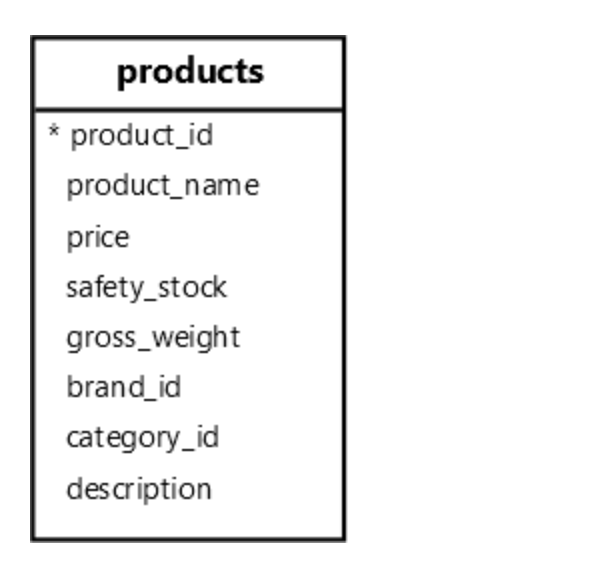

**摘要**：在本教程中，您将学习如何使用 `PostgreSQL CAST()` 函数和运算符将一种数据类型的值转换为另一种数据类型的值。

# `PostgreSQL Cast` 概述

要将一种数据类型的值转换为另一种数据类型的值，请使用 `CAST()` 函数或强制转换运算符 `（::)`

以下是 `CAST()` 函数的语法：

```sql
CAST(value AS target_type);
```

在此语法中：

- 首先，指定要强制转换的 `value` 。
- 其次，提供要将 `value` 转换为的目标数据类型 `（target_type）`。

`CAST()` 函数返回要强制转换为目标类型的值。

如果强制转换失败，`CAST()` 函数会发出错误。

为了更方便，`PostgreSQL` 提供了 `cast` 运算符 `(::)`，这比 `CAST` 功能：

```sql
value::target_type
```

强制转换运算符 `(::）` 将值强制转换为目标类型，如果失败则引发错误。

# 将字符串转换为整数

以下语句使用 `CAST()` 函数将字符串转换为整数：

```sql
SELECT
  CAST('10' AS INT) result;
```

输出：

```sql
 result
--------
     10
```

同样，您可以使用强制转换运算符将字符串 `10` 转换为整数：

```sql
SELECT
  '10'::INT result;
```

以下查询发出错误，因为 `CAST()` 函数无法将字符串 `10x` 转换为整数：

```sql
SELECT
  CAST('10x' AS INT) result;
```

输出：

```sql
ERROR:  invalid input syntax for type integer: "10x"
```

# 将字符串转换为双精度

以下示例使用 `CAST()` 函数将字符串转换为双精度：

```sql
SELECT
  CAST('9.99' AS DOUBLE PRECISION) result;
```

输出：

```sql
 result
--------
   9.99
```

以下是如何使用 `cast` 运算符 `(::)` ：

```sql
SELECT
  '9.99'::DOUBLE PRECISION result;
```

# 将字符串转换为布尔值

以下示例使用 `CAST()` 函数将字符串转换为布尔值：

```sql
SELECT
  CAST('true' AS BOOLEAN),
  CAST('false' AS BOOLEAN),
  CAST('T' AS BOOLEAN),
  CAST('F' AS BOOLEAN);
```

输出：

```sql
 bool | bool | bool | bool
------+------+------+------
 t    | f    | t    | f
```

铸造操作员：

```sql
SELECT
  'true'::bool,
  'false'::bool,
  'T'::bool,
  'F'::bool;
```

# 将字符串转换为日期

以下示例使用 `CAST()` 将字符串转换为日期：

```sql
SELECT
  CAST('2025-02-14' AS DATE),
  CAST('14-Feb-2025' AS DATE);
```

输出：

```sql
    date    |    date
------------+------------
 2025-02-14 | 2025-02-14

 SELECT
  '2025-02-14'::DATE,
  '14-Feb-2025'::DATE;
```

输出：

```sql
    date    |    date
------------+------------
 2025-02-14 | 2025-02-14
```

在这些示例中，`CAST()` 函数和运算符将字符串 `2025-02-14` 和 `14-Feb-2025` 转换为日期。

# 将字符串转换为区间

以下示例使用 `CAST` 函数或运算符将字符串强制转换为区间：

```sql
SELECT
  CAST('2 hours 30 minutes' AS INTERVAL) result;
```

输出：

```sql
  result
----------
 02:30:00

 SELECT '2 hours 30 minutes'::INTERVAL;
```

输出：

```sql
 interval
----------
 02:30:00
```

# 将时间戳转换为日期

以下语句使用 `CAST()` 函数将时间戳转换为日期：

```sql
SELECT
  CAST(TIMESTAMP '2025-02-14 12:30:45' AS DATE);
```

输出：

```sql
SELECT TIMESTAMP '2025-02-14 12:30:45'::DATE;

    date
------------
 2025-02-14
```

输出：

```sql
    date
------------
 2025-02-14
```

# 将间隔转换为文本

以下语句使用 `CAST()` 函数将间隔转换为日期：

```sql
SELECT
  CAST(INTERVAL '7 days' AS TEXT) result;
```

输出：

```sql
 result
--------
 7 days
```

# 将双精度转换为整数

以下语句使用 `CAST()` 函数将双精度转换为整数：

```sql
SELECT
  CAST(9.99 AS INT);
```

输出：

```sql
 int4
------
   10
```

# 将数组转换为字符串

以下示例使用 `CAST()` 函数将数组转换为文本：

```sql
SELECT
  CAST('{10, 20, 30}' AS TEXT);
```

输出：

```sql
     text
--------------
 {10, 20, 30}
```

# 将字符串转换为数组

以下示例使用 `CAST()` 函数将数组转换为文本：

```sql
SELECT CAST('{10,20,30}' AS INT[]) result;
```

输出：

```sql
SELECT
  '{10,20,30}'::INT[] result;

   result
------------
 {10,20,30}
```

输出：

```sql
   result
------------
 {10,20,30}
```

# 将 `PostgreSQL CAST` 函数与表数据一起使用

我们将使用 `inventory` 表中的 `products` 表：



以下示例使用 `CAST` 函数将字符串转换为数字：

```sql
SELECT
  product_name,
  CAST((REGEXP_MATCH(product_name, '\d+')) [1] AS INT) number
FROM
  products;
```

输出：

```sql
        product_name        | number
----------------------------+--------
 Samsung Galaxy S24         |     24
 Apple iPhone 15            |     15
 Huawei Mate 60             |     60
 Xiaomi Mi 14               |     14
 Sony Xperia 1 VI           |      1
 Samsung Galaxy Z Fold 5    |      5
...
```

运作方式

- 首先，使用 `REGEXP_MATCH` 函数从产品名称中提取第一个出现的数字。
- 其次，使用 `CAST` 函数将字符串转换为整数。

# 多重铸造

以下查询从 `XML` 片段中提取产品价格并将其转换为十进制：

```sql
SELECT
  (
    xpath(
      '/product/price/text()',
      XMLPARSE(
        CONTENT '<product> <name>Smartphone</name> <price>999.99</price> </product>'
      )
    )
  ) [1]::TEXT::DEC price;
```

输出：

```sql
 price
--------
 999.99
```

这个怎么运作

- `xpath` 函数从 `XML` 片段的价格元素中提取文本。它返回一个数组 `{999.99}`。
- `[1]` 返回结果数组 `999.99` 的第一个元素。数据是 `XML` 值。
- `::TEXT` 将 XML 值转换为 `TEXT` 值。
- `::DEC` 将 `TEXT` 的值转换为 `XML` 值。

请注意，不能将 `XML` 类型直接转换为数字。以下语句将发出错误：

```sql
SELECT
  (
    xpath(
      '/product/price/text()',
      XMLPARSE(
        CONTENT '<product> <name>Smartphone</name> <price>999.99</price> </product>'
      )
    )
  ) [1]::DEC price;
```

错误：

```sql
ERROR:  cannot cast type xml to numeric
```

# 隐式转换

`PostgreSQL` 有时可以自动将值转换为特定值，而无需 `CAST` 函数或运算符。例如：

```sql
SELECT
  1 + '2' result;
```

输出：

```sql
 result
--------
      3
```

在此示例中，`PostgreSQL` 自动将字符串 `2` 转换为整数，并将其添加到数字 `1` 中。

# 自定义 `casts`

您可以使用 `CREATE CAST` 语句为自定义类型创建强制转换。

以下是 `CREATE CAST` 语句的基本语法：

```sql
CREATE CAST (source_type AS target_type)
WITH
  FUNCTION function_name (arguments) AS IMPLICIT
```

让我们看看下面的例子。

首先，创建一个包含产品数据的复合类型：

```sql
CREATE TYPE product_info AS (name TEXT, price DEC);
```

其次，创建一个函数，将 `JSONB` 的值转换为 `product_info`：

```sql
CREATE FUNCTION jsonb_to_product_info(data JSONB) 
RETURNS product_info 
AS 
$$
SELECT 
    (data->>'name')::TEXT, 
    (data->>'price')::DEC;
$$ 
LANGUAGE SQL IMMUTABLE;
```

第三，创建一个自定义强制转换，以使用 `jsonb_to_product_info` 函数将 `JSONB` 转换为 `product_info`：

```sql
CREATE CAST (JSONB AS product_info)
WITH
  FUNCTION jsonb_to_product_info (JSONB) AS IMPLICIT;
```

在这份声明中：

- `WITH FUNCTION jsonb_to_product_info(JSONB)` 指定要用于强制转换的函数 `jsonb_to_product_info`。
- `AS IMPLICIT` ：允许 `PostgreSQL` 在需要时自动强制转换 `JSONB` 值。

第四，创建一个名为 `product_prices` 的表：

```sql
CREATE TABLE product_prices (
  id INT GENERATED ALWAYS AS IDENTITY PRIMARY KEY,
  data JSONB
);
```

第五，在 `product_prices` 表中插入一些行：

```sql
INSERT INTO
  product_prices (data)
VALUES
  ('{"name": "Smartphone", "price": 999.99}'),
  ('{"name": "Smartwatch", "price": 699.49}')
RETURNING
  data;
```

输出：

```sql
                  data
-----------------------------------------
 {"name": "Smartphone", "price": 999.99}
 {"name": "Smartwatch", "price": 699.49}
```

第六，从 `product_prices` 表中检索数据，并将其转换为 `product_info` ：

```sql
SELECT
  data::product_info
FROM
  product_prices;
```

输出:

```sql
        data
---------------------
 (Smartphone,999.99)
 (Smartwatch,699.49)
```

# 总结

- 使用 `CAST(value AS type)` 函数或 `value::type` 运算符将值显式转换为另一个不同类型的值。
- 使用 `CREATE CAST` 语句创建自定义强制转换。