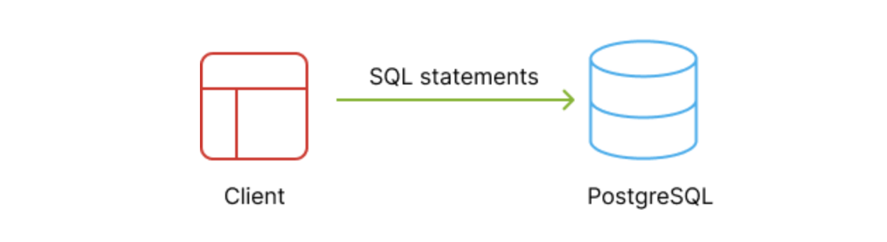

**摘要**: 在本教程中，您将了解 `PostgreSQL` 以及可以使用 `PostgreSQL` 构建的内容。

# 什么是数据库

数据库是存储信息的仓库。它允许你存储来自各种来源的数据，例如外部文件和网站，并以结构化的方式对其进行组织。

通常情况下，数据库将数据存储在硬盘上，以便日后检索或更新。

# 什么是 PostgreSQL

PostgreSQL , 通常称为 Postgres , 是一个免费和开源关系数据库管理系统(RDBMS):

在 `RDBMS` 管理系统中，数据被组织成多个相关的表。例如，你可以有一个表用于存储产品，另一个表用于存储发票。

PostgreSQL 以其稳健性、性能和灵活性而闻名。

PostgreSQL 被广泛应用于各类应用程序中，从小型项目到大型企业系统均有涉及。

# PostgreSQL 客户端

要操作 PostgreSQL 数据库，你需要一个客户端程序。

有许多类型的 PostgreSQL 客户端程序可供使用 :

- 桌面应用程序。
- Web应用程序。
- 命令行界面(CLI)程序。

一个 `PostgreSQL` 客户端程序会连接到 `PostgreSQL` 服务器。

要与 `PostgreSQL` 服务器交互，您需要编写结构化查询语言 (SQL) 语句来添加、检索、更新和删除数据：

值得注意的是，SQL 是一种标准化语言，用于与各种数据库进行交互，包括 `MySQL` 、 `Oracle` 和 `Microsoft SQL Server` 。

# 挑战

在使用 `PostgreSQL ` 时，你会遇到一些主要挑战:

- 如何编写高效的 SQL 查询从 `PostgreSQL` 数据库中检索数据。
- 如何为您的应用程序设计最佳数据库结构(或模式)。
- 了解何时使用 `PostgreSQL` 的功能，如索引、视图和存储过程。

