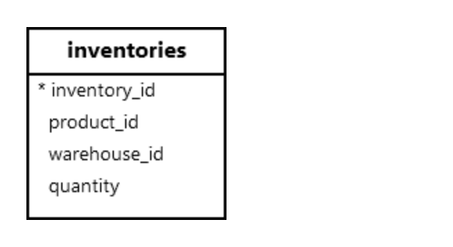
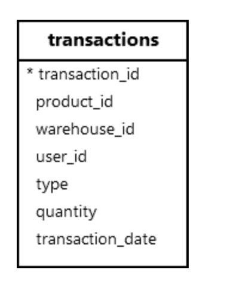

**摘要**：在本教程中，您将学习如何使用 `PostgreSQL AFTER INSERT` 触发器在表上发生插入事件后自动执行函数。

# `PostgreSQL AFTER INSERT` 触发器概述

触发器是一个数据库对象，它自动调用用户定义的函数或过程以响应特定表或视图上的事件。

在对表执行 `INSERT` 语句后触发 `AFTER INSERT` 触发器。您可以使用 `AFTER INSERT` 触发器中的 `NEW` 变量访问插入的行。

此外，您可以使用点表示法通过 `NEW` 变量访问插入行的列值：

```sql
NEW.column_name;
```

要创建 `AFTER INSERT` 触发器，请执行以下步骤：

**步骤 1** .创建一个触发器函数，该函数将在触发器事件发生时调用：

```sql
CREATE OR REPLACE FUNCTION trigger_function () 
RETURNS TRIGGER 
AS 
$$
BEGIN
    -- function body
    RETURN NEW;
END;
$$ LANGUAGE PLPGSQL;
```

`RETURN NEW` 是可选的，因为 `PostgreSQL` 已经完成了插入。在这种情况下，`PostgreSQL` 将忽略返回值。

**步骤 2** . 使用 `CREATE TRIGGER` 语句创建新触发器：

```sql
CREATE TRIGGER trigger_name
AFTER INSERT
ON table_name
FOR EACH { ROW | STATEMENT }
EXECUTE FUNCTION trigger_function();
```

# `PostgreSQL AFTER INSERT` 触发器示例

我们将使用 `AFTER INSERT` 触发器自动更新 `inventories` 表：



将新行插入 `transactions` 表后：



首先，创建一个新的触发器函数，根据插入到 `transactions` 表中的行更新库存：

```sql
CREATE OR REPLACE FUNCTION update_inventory()
RETURNS TRIGGER
AS
$$
BEGIN
    -- Attempt to update the inventory
    UPDATE inventories
    SET quantity = quantity + CASE
        WHEN NEW.type = 'receipt' THEN NEW.quantity
        WHEN NEW.type = 'issue' THEN -NEW.quantity
        ELSE 0
    END
    WHERE product_id = NEW.product_id AND warehouse_id = NEW.warehouse_id;

    -- If no rows were updated, handle missing inventory row
    IF NOT FOUND THEN
        IF NEW.type = 'receipt' THEN
            INSERT INTO inventories (product_id, warehouse_id, quantity)
            VALUES (NEW.product_id, NEW.warehouse_id, NEW.quantity);
        ELSE
            RAISE EXCEPTION 
                'Cannot issue stock: Inventory record does not exist for product_id = %, warehouse_id = %', 
                NEW.product_id, NEW.warehouse_id;
        END IF;
    END IF;

    RETURN NEW;
END;
$$
LANGUAGE plpgsql;
```

其次，为 `transactions` 表创建一个 `AFTER INSERT` 触发器：

```sql
CREATE TRIGGER after_transaction_insert
AFTER INSERT ON transactions
FOR EACH ROW
EXECUTE FUNCTION update_inventory();
```

第三，查看仓库 `id 1` 中产品 `id1` 的库存情况：

```sql
SELECT
  product_id,
  warehouse_id,
  quantity
FROM
  inventories
WHERE
  product_id = 1
  AND warehouse_id = 1;
```

输出：

```sql
 product_id | warehouse_id | quantity
------------+--------------+----------
          1 |            1 |      100
```

第四，在 `transactions` 表中插入一行新行：

```sql
INSERT INTO transactions (product_id, warehouse_id,user_id, type, quantity, transaction_date)
VALUES (1, 1, 1, 'receipt', 20, '2025-01-15');
```

`INSERT` 语句将触发调用 `update_inventory` 函数以更新 `inventories` 表的库存的触发器 `after_transaction_insert` 。

最后，检查仓库1中产品1的库存情况：

```sql
SELECT
  product_id,
  warehouse_id,
  quantity
FROM
  inventories
WHERE
  product_id = 1
  AND warehouse_id = 1;
```

输出：

```sql
 product_id | warehouse_id | quantity
------------+--------------+----------
          1 |            1 |      120
```

# 总结

- 使用表的 `AFTER INSERT` 触发器在将新行插入表后执行函数或过程。