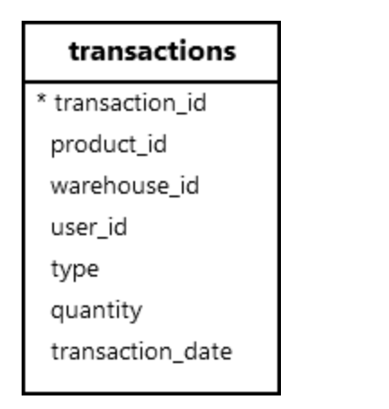
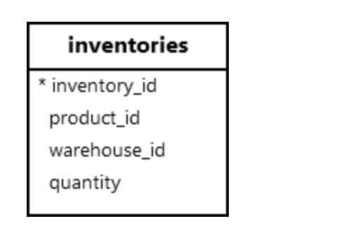

**摘要**：在本教程中，您将学习如何使用 `PostgreSQL BEFORE INSERT` 触发器在将数据插入表之前自动执行函数。

# `PostgreSQL` 在插入触发器之前概述

触发器是与表关联的数据库对象，当表上发生事件时自动触发。

在执行 `INSERT` 语句之前触发 `BEFORE INSERT` 触发器。当触发器触发时，它会自动调用用户定义的函数来执行特定任务。

例如，触发器函数可以跨表验证数据，以确保数据完整性，然后再将数据插入表中。

在触发器函数中，您可以访问将通过 `NEW` 记录变量插入的行。要从此行中检索特定列值，请使用如下所示的点表示法：

```sql
NEW.column_name;
```

要创建 `BEFORE INSERT` 触发器，请使用以下步骤：

**步骤 1**.创建一个触发器函数，该函数将在插入事件发生之前调用：

```sql
CREATE OR REPLACE FUNCTION trigger_function () 
RETURNS TRIGGER 
AS 
$$
BEGIN
    -- function body
    RETURN NEW;
END;
$$ 
LANGUAGE PLPGSQL;
```

**步骤 2**. 使用 `CREATE TRIGGER` 语句创建一个新触发器，并将触发器函数与触发器相关联：

```sql
CREATE TRIGGER trigger_name
BEFORE INSERT
ON table_name
FOR EACH { ROW | STATEMENT }
EXECUTE FUNCTION trigger_function();
```

在此语法中：

- 首先，在 `CREATE TRIGGER` 关键字后指定触发器名称。
- 接下来，使用 `BEFORE INSERT` 触发器计时来指示触发器应在插入事件之前触发。
- 然后，在 `ON` 子句中指定触发器所属的表名。
- 之后，使用 `FOR EACH ROW` 或 `STATEMENT`
- 最后，在 `EXECUTE FUNCTION` 子句中提供触发器触发时要执行的函数的名称。

# `PostgreSQL BEFORE INSERT` 触发器示例

我们将创建一个触发器来验证 `transactions` 中的库存交易：



不会导致 `inventories` 表中的负数量：



首先，创建一个触发器函数，根据交易验证库存：

```sql
CREATE OR REPLACE FUNCTION validate_inventory()
RETURNS TRIGGER 
AS $$
DECLARE
    v_quantity INT;
BEGIN
    -- Get the current inventory level
    SELECT quantity INTO v_quantity
    FROM inventories
    WHERE product_id = NEW.product_id 
      AND warehouse_id = NEW.warehouse_id;

    -- If the transaction is an issue, ensure it does not lead 
    -- to negative inventory
    IF NEW.type = 'issue' THEN
        IF v_quantity IS NULL OR v_quantity < NEW.quantity THEN
            RAISE EXCEPTION 'Insufficient inventory for product_id %, warehouse_id %', 
                            NEW.product_id, NEW.warehouse_id;
        END IF;
    END IF;

    RETURN NEW;
END;
$$ 
LANGUAGE plpgsql;
```

其次，在 `transactions` 表上创建一个触发器，该触发器与 `validate_inventory` 函数相关联：

```sql
CREATE TRIGGER before_insert_transaction
BEFORE INSERT ON transactions
FOR EACH ROW
EXECUTE FUNCTION validate_inventory();
```

第三，在仓库id 2处获取产品id2的库存数量：

```sql
SELECT * 
FROM inventories
WHERE product_id = 2 AND 
      warehouse_id = 2;
```

输出：

```sql
 inventory_id | product_id | warehouse_id | quantity
--------------+------------+--------------+----------
            2 |          2 |            2 |      150
```

第四，尝试创建一个在仓库 `ID 2` 处发放 `200` 件产品 `ID 2` 的交易：

```sql
INSERT INTO transactions (
    product_id,
    warehouse_id,
    user_id,
    type,
    quantity,
    transaction_date
  )
VALUES
  (2, 2, 1, 'issue', 200, '2025-01-15');
```

`PostgreSQL` 发出以下错误：

```sql
ERROR: Insufficient inventory for product_id 2, warehouse_id 2
CONTEXT: PL/pgSQL function validate_inventory() line 13 at RAISE
```

最后，创建一个发出有效数量的有效交易：

```sql
INSERT INTO transactions (product_id, warehouse_id, user_id, type, quantity, transaction_date)
VALUES (2, 2, 1, 'issue', 20, '2025-01-15');
```

> 请注意，您可以创建 `AFTER INSERT` 触发器来更新 `inventories` 表中的库存数量。

# 总结

- 在将新行插入到表中之前，使用 `BEFORE INSERT` 触发器自动执行函数。