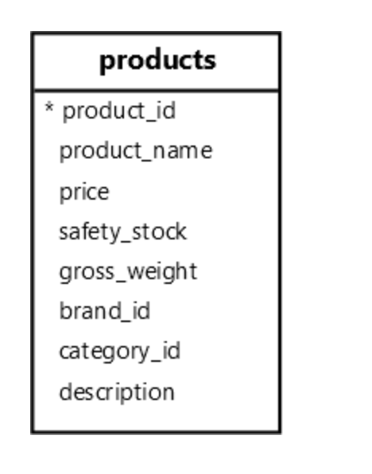

**摘要**：在本教程中，您将了解 `PostgreSQL` 触发器以及如何使用它们来自动执行一些数据库任务。

# `PostgreSQL` 触发器简介

在 `PostgreSQL` 中，触发器是当 `INSERT`、`UPDATE`、`DELETE` 或 `TRUNCATE` 等事件发生在表或视图上时自动调用的用户定义函数或过程。

在实践中，您可以发现触发器在以下情况下很有帮助：

- Logging
- Auditing
- 验证简单约束无法完成的复杂业务规则。

触发器包括四个关键组件：

- Trigger events
- Trigger timing
- Trigger function
- Trigger scope

# 触发事件

触发器事件是导致触发器触发的事件。在 `PostgreSQL` 中，触发器事件是：

- `INSERT`
- `UPDATE`
- `DELETE`
- `TRUNCATE`

例如，向表中插入新行将触发触发器。

# 触发函数

触发器函数是用户定义的函数或过程，在触发器触发时执行。

触发器函数总是返回一个 `TRIGGER` 。在触发器函数内部，您可以访问特殊变量，例如 `TG_OP` 、`NEW` 和 `OLD` 。

- `TG_OP` 变量存储导致触发器触发的操作。它可以是`INSERT`、`UPDATE`、`DELETE` 和 `TRUNCATE`。
- `NEW` 变量存储新行。此变量仅在操作为 `INSERT` 或 `UPDATE` 时可用。
- `OLD` 变量存储旧行，可在 `UPDATE` 或 `DELETE` 操作中使用。

# 触发时间

触发器计时指定触发器触发的时间：

- `BEFORE` - 在触发事件之前执行触发函数。
- `AFTER` - 在触发事件之后执行触发函数。

# 触发范围

- 行级：触发器函数对每个受影响的行执行。例如，如果您发出更新 `10` 行的 `UPDATE` 语句，触发器将触发 `10` 次，每次每行。
- 语句级：触发器函数按 `SQL` 语句执行。例如，如果运行 `UPDATE` 语句，则语句级触发器将触发一次，而与更新的行数无关。

# 创建触发器

要创建触发器，请执行以下步骤：

- 首先，定义一个用户定义的函数或过程在触发器触发时执行。
- 其次，使用 `CREATE TRIGGER` 语句将触发器函数与触发器相关联。

`CREATE TRIGGER` 语句允许您使用关键触发器组件创建新触发器：

```sql
CREATE [OR REPLACE] TRIGGER trigger_name
{ BEFORE | AFTER }
{ INSERT | DELETE | TRUNCATE | UPDATE [OF column_name, ...] }
ON table_name
[ FOR [ EACH ] { ROW | STATEMENT } ]
EXECUTE { FUNCTION | PROCEDURE } function_name(arguments);
```

在这种语法中：

- 首先，`CREATE TRIGGER` 创建一个新触发器，而 `CREATE OR REPLACE TRIGGER` 创建一个新触发器或替换一个现有触发器（如果触发器已经存在）。
- 其次，在 `CREATE TRIGGER` 关键字之后指定触发器的名称（ `trigger_name` ）。
- 第三，指示触发时间，例如 `BEFORE` 或 `AFTER` ，以及触发事件，例如 `INSERT`、`UPDATE`、`DELETE`和`TRUNCATE`。
- 第四，在 `ON` 关键字之后指定触发器与之关联的表名。
- 第五，定义触发范围，可以是 `ROW` 或 `STATEMENT` 在 `FOR EACH` 关键字之后。
- 最后，将用户定义的函数或过程名称与 `EXECUTE` 子句中的触发器相关联。

要创建触发器函数，您需要使用 `PL/pgSQL` 过程语言。

# 创建触发器示例

我们将创建一个触发器，记录 `products` 表中的安全库存变化：



首先，创建一个名为 `safety_stock_logs` 的表，该表存储日志数据，包括产品 `ID` 、旧安全库存、新安全库存和更新时间：

```sql
CREATE TABLE IF NOT EXISTS safety_stock_logs (
  id INT GENERATED ALWAYS AS IDENTITY PRIMARY KEY,
  product_id INT NOT NULL,
  old_safety_stock INT NOT NULL,
  new_safety_stock INT NOT NULL,
  updated_at TIMESTAMPTZ NOT NULL DEFAULT NOW(),
  FOREIGN KEY (product_id) REFERENCES products (product_id) ON DELETE CASCADE
);
```

接下来，创建一个触发器函数来捕获产品 `ID` 、旧安全库存和新安全库存，并将它们插入到 `safety_stock_logs` 表中：

```sql
CREATE OR REPLACE FUNCTION log_safety_stock_changes()
RETURNS TRIGGER 
AS 
$$
BEGIN
  IF NEW.safety_stock != OLD.safety_stock THEN
    INSERT INTO safety_stock_logs (product_id, old_safety_stock, new_safety_stock)
    VALUES (OLD.product_id, OLD.safety_stock, NEW.safety_stock);
  END IF;
  RETURN NEW;
END;
$$ 
LANGUAGE plpgsql;
```

然后，创建一个触发器，每当安全库存发生变化时调用 `log_safety_stock_changes` 函数：

```sql
CREATE OR REPLACE TRIGGER safety_stock_update_trigger
AFTER UPDATE OF safety_stock
ON products
FOR EACH ROW
EXECUTE FUNCTION log_safety_stock_changes();
```

之后，将 `id` 为 `1` 的产品的安全库存更新为 `15` ：

```sql
UPDATE products 
SET safety_stock = 15
WHERE product_id = 1;
```

`UPDATE` 语句会触发触发器，从而将新行插入到 `safety_stock_logs` 表中。

最后，从 `safety_stock_logs` 表中检索数据：

```sql
SELECT
  id,
  product_id,
  old_safety_stock,
  new_safety_stock
FROM
  safety_stock_logs;
```

输出：

```sql
 id | product_id | old_safety_stock | new_safety_stock |
----+------------+------------------+------------------+-
  1 |          1 |               20 |               15 |
```

# 总结

触发器是用户定义的函数或过程，当表或视图上发生 `INSERT`、`UPDATE`、`DELETE`和`TRUNCATE` 等事件时自动调用。

