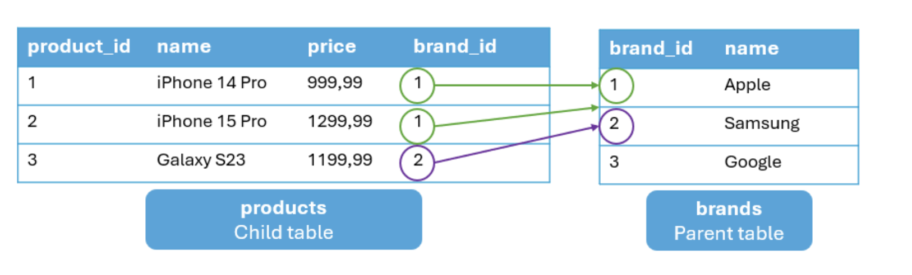
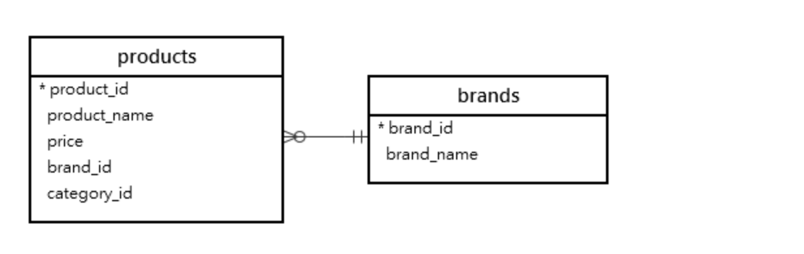
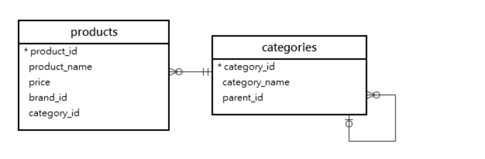
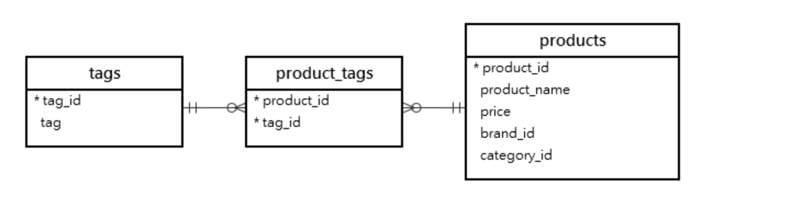

**摘要**: 在本教程中，你将了解外键以及如何使用 `PostgreSQL` 外键约束为表创建外键列。

# 外键简介

在 `PostgreSQL` 中，外键是一个表中的一列或一组列，它引用另一个表的 [`主键`](主键.md)。外键起到了连接两个表的作用。

例如，下面的 `products` 表有一个名为 `brand_id` 的外键列，该列引用 `brands` 表的 `brand_id` 列:



包含外键列的表称为子表，而子表所引用的包含主键列的表被称为被引用表或父表。

在这个示例中，`brands` 表是被引用的表或父表，而 `products` 表是子表。

外键确保子表中的数据与父表中的相关数据相匹配。例如，如果你的 `products` 表中有一个品牌ID,那么该品牌ID应与 `brands` 表中的某个品牌ID相匹配。

外键有助于维护引用完整性。例如，如果某个产品引用了一个品牌，那么该品牌必须存在于 `brands`表中。

当你删除父表中的一行时，应妥善处理子表，以避免出现孤立记录。

> 请注意,孤立记录是指一个表中引用了另一个表中不存在的主键值的记录。

例如,如果 `brands` 中的一行被删除，`products` 表中所有相关的行都应自动删除。

# 一对多关系中的外键

当两个表存在一对多关系时,"多"的一方的表会包含外键列。

例如，`brands` 表和 `products` 表之间的关系是一对多。`products` 表是":的一方;它应该有一个外键列:



`products` 表有一个名为 `brand_id` 的附加列，该列引用 `brands` 表的 `brand_id`。

同样，`categories` 表和 `products` 表之间的关系是一对多关系。

`products` 表有一个名为 `category_id` 的外键列，该列引用了 `categories` 表的 `category_id` 列:



一个表可能有多个外键列，例如 `products` 表。

外键列中的值等于引用行的主键中的值。例如，中的第一行的 `brand_id` 列等于 `brand_id` 列的 `brands` 表。

按照惯例，外键列的格式为 `table_id` 。例如，外键列是 `category_id` 和 `brand_id`。

多行可以具有相同的外键列值。例如，产品名称为 `iPhone 14 Pro` 和 `iPhone 15 Pro` 的两行都具有相同的 `brand_id` 1。

# 多对多关系中的外键

在 `PostgreSQL` 中，你可以使用两个一对多关系来建模多对多关系。

例如，`products` 表和 `tags` 表之间的关系是多对多的。

为了建模这种关系，我们创建了一个名为 `product_tags` 的新表，该表通常被称为链接表:



`product_tags` 将有两个外键;一个引用 `products` 表中的 `product_id` 列，另一个引用 `tags` 表中的 `tag_id` 列。

# 外键约束 

在 `PostgreSQL` 中，您可以使用外键约束来设置外键。

以下是定义外键约束的基本语法:

```sql
CONSTRAINT constraint_name
FOREIGN KEY (fk_column)
REFERENCES table(pk_column)
ON DELETE delete_action
ON UPDATE update_action;
```

在该语法中:

- 首先,在 `CONSTRAINT` 子句中指定外键约束的名称。如果不指定，`PostgreSQL`会自动生成一个约束名称。
- 其次,将外键列 `(fk_column)` 放在 `FOREIGN KEY` 关键字后的括号 `()` 内。
- 第三,在 `REFERENCES` 关键字后提供外键列所引用的表和主键列。
- 最后,设置删除和更新操作,以指定当父表中主键所在行被删除和更新时的行为。

`FOREIGN KEY` 和 `REFERENCES` 子句是强制性的，而 `CONSTRAINT` 、`ON DELETE` 和 `ON UPDATE` 子句是可选的。

# 外键约束示例

首先, [`创建一个新表`](../第1节-PostgreSQL入门/创建新表.md),名为 `brands`:

```sql
CREATE TABLE brands (
    brand_id INT GENERATED ALWAYS AS IDENTITY PRIMARY KEY,
    name VARCHAR(255) NOT NULL
);
```

其次,使用外键列 `brand_id` 创建一个名为产品的新表,该表引用品牌表的 `brand_id` 列:

```sql
CREATE TABLE products (
   product_id INT GENERATED ALWAYS AS IDENTITY PRIMARY KEY,
   name VARCHAR(100) NOT NULL,
   price DECIMAL(10, 2) NOT NULL,
   brand_id INT NOT NULL,
   FOREIGN KEY (brand_id) REFERENCES brands (brand_id)
);
```

第三,将三行插入 `brands` 表:

```sql
INSERT INTO brands(name)
VALUES ('Apple'), ('Samsung'), ('Google')
RETURNING *;
```

输出:

```sql
 brand_id |  name
----------+---------
        1 | Apple
        2 | Samsung
        3 | Google
```

# 向外键表中插入数据

如果你向 `products` 表中插入新行，则 `brand_id` 的值必须存在于 `brands` 表中。例如，以下语句向 `products` 表中插入一行新数据，其中 `brand_id` 为1:

```sql
INSERT INTO products(name, price, brand_id)
VALUES('iPhone 14 Pro', 999.99, 1)
RETURNING *;
```

输出:

```sql
 product_id |     name      | price  | brand_id
------------+---------------+--------+----------
          1 | iPhone 14 Pro | 999.99 |        1
```

如果您尝试插入品牌 `ID` 不存在的行，您将遇到错误 `brands` 表。

以下语句尝试向 `products` 表中插入一行新数据，但使用了无效的品牌 `ID`:

```sql
INSERT INTO products(name, price, brand_id)
VALUES('iPhone 15 Pro', 1299.99, 11)
RETURNING *;
```

`PostgreSQL` 会发出以下错误:

```sql
insert or update on table "products" violates foreign key constraint "products_brand_id_fkey"
```

# 删除带有外键约束的表

当您通过外键约束删除被其他表引用的表时,`PostgreSQL` 会发出错误。

例如，`products` 表通过外键约束引用 `brands` 表。如果删除品牌表，将会出现错误:

```sql
DROP TABLE brands;
```

错误:

```sql
cannot drop table brands because other objects depend on it
```

`drop brands` 表，您按照以下步骤操作:

- 首先, 删除引用 `brands` 表中 `brand_id` 列的外键约束。
- 其次,删除表 `brands` 。

您可以使用 `DROP TABLE ... CASCADE `语句来完成这两个步骤:

```sql
DROP TABLE brands CASCADE;
```

此语句删除了表 `products` 上的约束 `products_brand_id_fkey`。

我们也来删除 `products` 表:

```sql
DROP TABLE products;
```

# 删除操作

删除操作允许你在父表中的行被删除时，为子表中的行指定一个操作。

```sql
ON DELETE delete_action;
```

`delete_action` 可以是以下情况之一:

- `NO ACTION` -- 发出约束违反错误。`NO ACTION` 是默认设置。
- `SET NULL` -- 将外键列的值设置为 `NULL` 。
- `CASCADE` -- 删除子表中所有相关的行。
- `SET DEFAULT` -- 为子表中的外键列设置默认值。
- `RESTRICT` 的作用类似于 `NO ACTION` 。

# 删除时设为 `NULL`

首先，重新创建 `brands ` 表:

```sql
CREATE TABLE brands (
    brand_id INT GENERATED ALWAYS AS IDENTITY PRIMARY KEY,
    name VARCHAR(255) NOT NULL
);
```

其次, 创建 `products` 表，该表将 `brand_id` 作为外键列，引用 `brands` 表的 `brand_id` 列:

```sql
CREATE TABLE products (
  product_id INT GENERATED ALWAYS AS IDENTITY PRIMARY KEY,
  name VARCHAR(100) NOT NULL,
  price DECIMAL(10, 2) NOT NULL,
  brand_id INT,
  FOREIGN KEY (brand_id) REFERENCES brands (brand_id) 
  ON DELETE SET NULL
);
```

第三,将行插入到 `brands` 和 `products` 表:

```sql
INSERT INTO brands(name)
VALUES ('Apple'), ('Samsung')
RETURNING *;

INSERT INTO products(name, price, brand_id)
VALUES
('iPhone 14 Pro', 999.99, 1),
('iPhone 15 Pro', 1299.99, 1),
('Galaxy S23 Ultra', 1299.99, 2)
RETURNING *;
```

第四,在 `brangs` 表中 `delete` 一条ID 为 1 的数据:

```sql
DELETE FROM brands WHERE brand_id = 1;
```

最后,从 `products` 表中查询数据:

```sql
SELECT * FROM products;
```

输出:

```sql
 product_id |       name       |  price  | brand_id
------------+------------------+---------+----------
          3 | Galaxy S23 Ultra | 1299.99 |        2
          1 | iPhone 14 Pro    |  999.99 |     NULL
          2 | iPhone 15 Pro    | 1299.99 |     NULL
```

输出显示，`ON DELETE SET NULL` 操作会将相关产品的 `brand_id` 列的值设置为 `NULL` 。

# 删除时级联

首先,删除 `brands` 和 `products` 表:

```sql
DROP TABLE brands, products;
```

其次,创建带有 `ON DELETE CASCADE` 操作的 `brands` 表和 `products` 表:

```sql
CREATE TABLE brands (
    brand_id INT GENERATED ALWAYS AS IDENTITY PRIMARY KEY,
    name VARCHAR(255) NOT NULL
);
CREATE TABLE products (
  product_id INT GENERATED ALWAYS AS IDENTITY PRIMARY KEY,
  name VARCHAR(100) NOT NULL,
  price DECIMAL(10, 2) NOT NULL,
  brand_id INT,
  FOREIGN KEY (brand_id) REFERENCES brands (brand_id) 
  ON DELETE CASCADE
);
```

第三,向 `products` 表中插入行:

```sql
INSERT INTO brands(name)
VALUES('Apple'), ('Samsung')
RETURNING *;

INSERT INTO products(name, price, brand_id)
VALUES
('iPhone 14 Pro', 999.99, 1),
('iPhone 15 Pro', 1299.99, 1),
('Galaxy S23 Ultra', 1299.99, 2)
RETURNING *;
```

第四,删除一行 来自于 `brands` 表的 `ID` 为 `1` 的数据:

```sql
DELETE FROM brands 
WHERE brand_id = 1;
```

最后,从 `products` 表中查询数据:

```sql
SELECT * FROM products;
```

输出:

```sql
 product_id |       name       |  price  | brand_id
------------+------------------+---------+----------
          3 | Galaxy S23 Ultra | 1299.99 |        2
```

输出显示, `ON DELETE CASCADE` 操作会删除 `products` 表中 `brand_id` 列值为 `1` 的行。

# 删除时设置默认值

首先,删除 `brands` 和 `products` 表:

```sql
DROP TABLE brands, products;
```

其次,创建 `brands` 表:

```sql
CREATE TABLE brands (
    brand_id INT GENERATED ALWAYS AS IDENTITY PRIMARY KEY,
    name VARCHAR(255) NOT NULL
);
```

第三,创建 `products` 表:

```sql
CREATE TABLE products (
  product_id INT GENERATED ALWAYS AS IDENTITY  PRIMARY KEY,
  name VARCHAR(100) NOT NULL,
  price DECIMAL(10, 2) NOT NULL,
  brand_id INT DEFAULT 1,
  FOREIGN KEY (brand_id) REFERENCES brands (brand_id) 
  ON DELETE SET DEFAULT
);
```

在这条语句中，我们将 `brand_id` 列的默认值设置为 `1` 。

第四，向 `brands` 表中插入行:

```sql
INSERT INTO brands(name)
VALUES('Unknown'),
      ('Apple'), 
      ('Samsung')
RETURNING *;
```

`ID` 为 `1` 的行将是"Unknown"。

第五,向 `products` 表中插入行:

```sql
INSERT INTO products(name, price, brand_id)
VALUES
('iPhone 14 Pro', 999.99, 2),
('iPhone 15 Pro', 1299.99, 2),
('Galaxy S23 Ultra', 1299.99, 3)
RETURNING *;
```

第六,从 `brands` 表中删除 `id` 为 `2` 的行:

```sql
DELETE FROM brands 
WHERE brand_id = 2;
```

由于 `ON DELETE SET DEFAULT` 操作，该语句会将 `brand_id` 为 `2` 的行的 `brand_id` 列的值设置为 `1` 。

第七,从 `products` 表中查询数据：

```sql
SELECT * FROM products;
```

输出:

```sql
 product_id |       name       |  price  | brand_id
------------+------------------+---------+----------
          3 | Galaxy S23 Ultra | 1299.99 |        3
          1 | iPhone 14 Pro    |  999.99 |        1
          2 | iPhone 15 Pro    | 1299.99 |        1
```

输出显示,`ON DELETE SET DEFAULT` 操作会将相关产品的 `brand_id` 列的值设置为 ` brand_id` 列的默认值，即 `1` 。

# 总结

- 外键是一个或一组列,用于引用另一个表的主键。
- 个表可以有一个或多个外键列。
- 使用 `PostgreSQL` 外键约束为表创建外键。
- 当从父表中删除相应的行时,使用 `ON DELETE SET NULL` 将外键列的值设置为 `NULL` 。
- 使用 `ON DELETE CASCADE` 可以在删除父表中相应行时，删除子表中的行。
- 当父表中的对应行被删除时，使用 `ON DELETE SET DEFAULT` 将外键列的值设置为其默认值。
- 使用 `ON DELETE NO ACTION` 可以防止当父表中的行在子表中有引用行时被删除。
