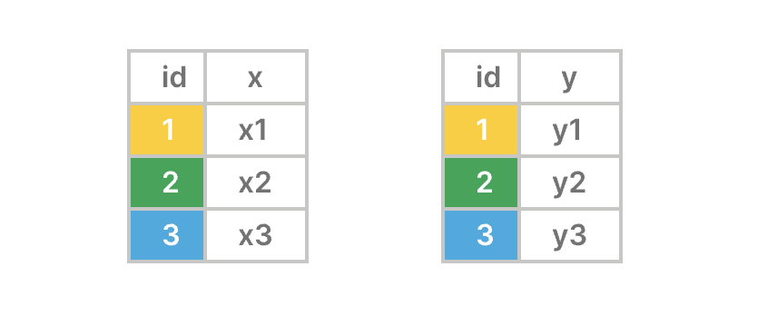
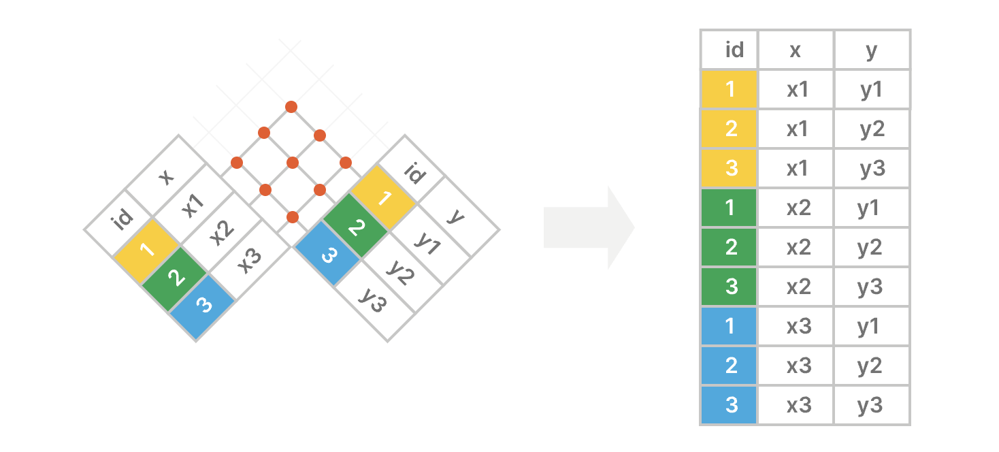
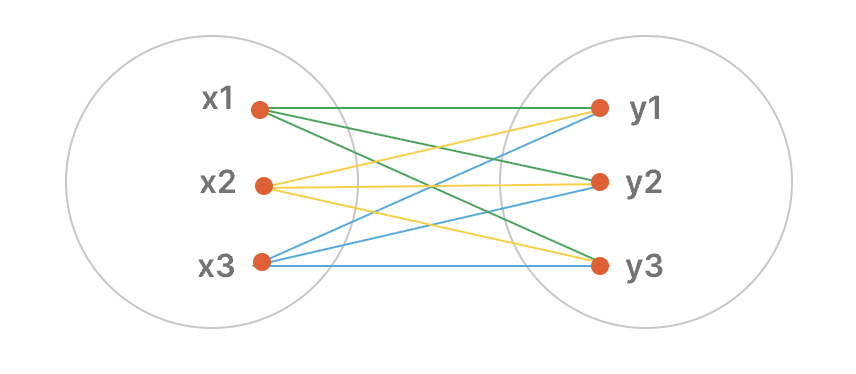

**摘要**：在本教程中，你将学习如何使用 `PostgreSQL` 的 `CROSS JOIN` 来合并两个表中的行。

# 探索 `PostgreSQL Cross Join ` 连接子句

`CROSS JOIN` 将第一个表中的每一行与第二个表中的每一行进行组合，并返回所有行的组合。

与内连接 `(inner join)` 、左连接 `(left join)` 和全连接 `(full join)` 等其他连接不同，交叉连接没有用于匹配两个表中行的条件。

以下是 `CROSS JOIN` 子句的语法：

```sql
SELECT
  table1.column1,
  table2.column2,
  ...
FROM
  table1
  CROSS JOIN table2;
```

在此语法中：

- 首先，在 `FROM` 子句中指定第一个表 `(table1)` 的名称。
- 其次，提供 `CROSS JOIN` 子句中第二个表 `(table2)` 的名称。
- 第三，在 `SELECT` 子句中列出你想要从两个表中查询数据的列。

如果 `table1` 有 `n` 行，`table2` 有 `m` 行，那么 `CROSS JOIN` 将返回一个包含 `nxm` 行的结果集。

或者，你可以通过在 `FROM` 子句中列出两个表来形成交叉连接，这样语句会更简洁但不那么直观：

```sql
SELECT
  table1.column1,
  table2.column2,
  ...
FROM
  table1, table2;
```

实际上，当你希望获得两个表中所有可能的行组合时，就会使用 `cross-join` 连接。

# 理解 `cross-join` 连接

假设你想使用交叉连接来连接两个表 `X` 和 `Y` ：

- `X` 表有两列：`id` (键) 和 `x` 。
- `Y` 表也有两列：`id` (键) 和 `y` 。



`cross-join` 连接返回的结果集包含左表中的行与右表中的行的所有可能组合。



以下图表是另一种描述 `cross-join` 连接的方式：



# 创建示例表

首先，创建一个新的名为 `products` 的表：

```sql
CREATE TABLE products (
  product_id INT GENERATED ALWAYS AS IDENTITY PRIMARY KEY,
  name VARCHAR(100) NOT NULL,
  price DECIMAL(10, 2) NOT NULL
);
```

其次，向 `products` 表中插入三行数据：

```sql
INSERT INTO
  products (name, price)
VALUES
  ('iPhone 14 Pro', 999.99),
  ('iPhone 15 Pro', 1199.99),
  ('Galaxy S23 Ultra', 1149.47) 
RETURNING *;
```

输出：

```sql
 product_id |       name       |  price
------------+------------------+---------
          1 | iPhone 14 Pro    |  999.99
          2 | iPhone 15 Pro    | 1199.99
          3 | Galaxy S23 Ultra | 1149.47
```

第三，创建一个新表，名为 `warehouses` ：

```sql
CREATE TABLE warehouses (
  warehouse_id INT GENERATED ALWAYS AS IDENTITY PRIMARY KEY,
  name VARCHAR(100) NOT NULL
);
```

最后，向 `warehouses` 表中插入两行：

```sql
INSERT INTO
  warehouses(name)
VALUES
  ('San Jose'),
  ('San Francisco')
RETURNING *;
```

输出：

```sql
 warehouse_id |     name
--------------+---------------
            1 | San Jose
            2 | San Francisco
```

# `PostgreSQL`  `cross-join` 连接示例

假设你必须前往每个仓库进行实物盘点。在此过程中，你需要核对仓库名称、产品以及数量。

在使用交叉连接检查库存之前，您可以生成一个包含所有可能的仓库和产品组合的列表：

```sql
SELECT
  w.name warehouse_name,
  p.name product_name,
  '' quantity 
FROM
  products p
  CROSS JOIN warehouses w;
```

输出：

```sql
 warehouse_name |   product_name   | quantity
----------------+------------------+----------
 San Jose       | iPhone 14 Pro    |
 San Jose       | iPhone 15 Pro    |
 San Jose       | Galaxy S23 Ultra |
 San Francisco  | iPhone 14 Pro    |
 San Francisco  | iPhone 15 Pro    |
 San Francisco  | Galaxy S23 Ultra |
```

第三列 `quantity` 是一个空白栏，用于填写每个仓库中每种产品的数量。

以下语句使用交叉连接的替代语法来合并来自 `products` 表和 `warehouses` 表的行：

```sql
SELECT
  w.name warehouse_name,
  p.name product_name,
  '' quantity 
FROM
  products p, warehouses w;
```

它返回与上面查询相同的输出。

# 总结

- 使用 `CROSS JOIN` 返回两个表中所有行的组合。
