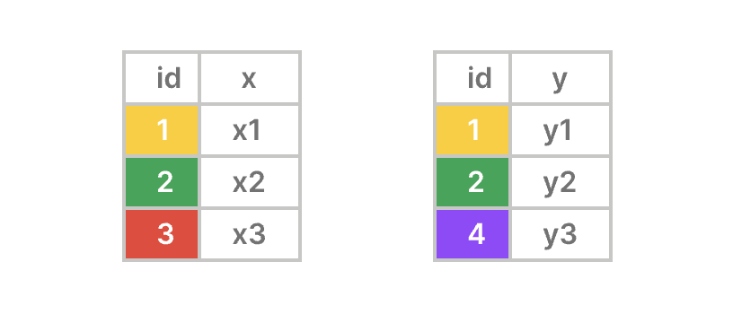
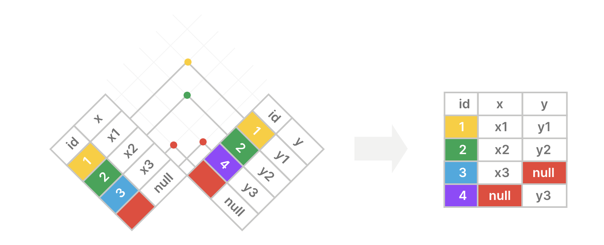
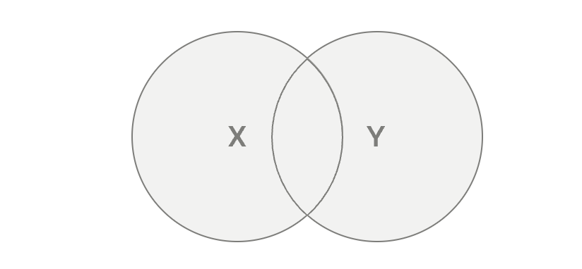

**摘要**：在本教程中，你将学习如何使用 `PostgreSQL` 的 `FULL JOIN` 来合并两个表中的行。

# `PostgreSQL FULL JOIN` 语句简介

`FULL JOIN` 会合并两个表中的行，并返回两个表中的所有行。此外，`FULL JOIN` 会对没有匹配行的表的每个列使用 `NULL` 值。

换句话说，`FULL JOIN` 结合了 [左连接`(LEFT JOIN)`](./Left-Join.md)  和 [右连接 `(RIGHT JOIN)` ](./Right-Join.md) 的结果集。

以下是 `FULL JOIN` 表的语法：

```sql
SELECT
  table1.column1,
  table2.column2,
  ...
FROM
  table1
  FULL JOIN table2 ON table2.column1 = table1.column1;
```

在以下语法中：

- 首先，在 `FROM` 子句中指定第一个表 `(table1)` 的名称。
- 其次，在 `FULL JOIN` 子句中提供你要执行全连接的第二个表 `(table2)` 的名称。
- 第三，在 `ON` 子句中使用条件来匹配两个表中的行。该条件通过比较 `table1` 中 `column1` 的值与 `table2` 中 `column1` 的值来匹配行。
- 最后，在 `SELECT` 子句中指定你想要检索数据的列。

`FULL OUTER JOIN` 是 `FULL JOIN` 的替代语法：

```sql
SELECT
  table1.column1,
  table2.column2,
  ...
FROM
  table1
  FULL OUTER JOIN table2 ON table2.column1 = table1.column1;
```

> 请注意，`OUTER` 关键字是可选的

# `PostgreSQL` 的 `FULL JOIN` 是如何工作的：

- 首先，`FROM` 子句返回 `table1` 中的所有行。
- 其次，`FULL JOIN` 通过比较两个表中 `column1` 的值，将 `table1` 中的每一行与 `table2` 中的每一行进行匹配。如果匹配，`FULL JOIN` 会将两行合并为一行。否则，它会为没有匹配项的表的行的列填充 `NULLs`，并与另一个表的行合并。
- 第三，返回一个包含在 `SELECT` 子句中指定的列的结果集。

# 了解 `PostgreSQL` 全连接

假设你想要使用全连接合并来自 `X` 表和 `Y` 表的行：

- `X` 表有两列：`id` (键) 和 `x` 。
- `Y` 表也有两列：`id` (键) 和 `y` 。



全外连接返回的结果集包含两个表中的行，无论这些行在另一个表中是否有匹配的行。对于在另一个表中没有匹配行的表中的行，其列会填充 `NULLs` ：



以下维恩图是另一种描述全连接工作原理的方式：



# 设置示例表

首先，[创建一个新表](../第1节-PostgreSQL入门/创建新表.md)，名为 `warehouses`，并添加一些示例数据：

```sql
CREATE TABLE brands (
  brand_id INT GENERATED ALWAYS AS IDENTITY PRIMARY KEY,
  name VARCHAR(255) NOT NULL
);
```

其次，向 `brands` 表中插入三行数据：

```sql
INSERT INTO
  brands (name)
VALUES
  ('Apple'),
  ('Samsung'),
  ('Google') RETURNING *;
```

输出：

```sql
 brand_id |  name
----------+---------
        1 | Apple
        2 | Samsung
        3 | Google
```

第三，创建一个新表，名为 `products`：

```sql
CREATE TABLE products (
  product_id INT GENERATED ALWAYS AS IDENTITY PRIMARY KEY,
  name VARCHAR(100) NOT NULL,
  price DECIMAL(10, 2) NOT NULL,
  brand_id INT,
  FOREIGN KEY (brand_id) REFERENCES brands (brand_id)
);
```

最后，向 `products` 表中插入四行数据：

```sql
INSERT INTO
  products (name, price, brand_id)
VALUES
  ('iPhone 14 Pro', 999.99, 1),
  ('iPhone 15 Pro', 1199.99, 1),
  ('Galaxy S23 Ultra', 1149.47, 2),
  ('Oppo Find Flip', 499.99, NULL) 
RETURNING *;
```

输出：

```sql
 product_id |       name       |  price  | brand_id
------------+------------------+---------+----------
          1 | iPhone 14 Pro    |  999.99 |        1
          2 | iPhone 15 Pro    | 1199.99 |        1
          3 | Galaxy S23 Ultra | 1149.47 |        2
          4 | Oppo Find Flip   |  499.99 |     NULL
```

# `PostgreSQL` 全连接示例

以下语句使用 `FULL JOIN` 来合并来自 `products` 表和 `brands` 表的行：

```sql
SELECT
  p.name as product_name,
  p.price,
  b.name brand_name
FROM
  products p
  FULL JOIN brands b ON b.brand_id = p.brand_id;
```

输出：

```sql
   product_name   |  price  | brand_name
------------------+---------+------------
 iPhone 14 Pro    |  999.99 | Apple
 iPhone 15 Pro    | 1199.99 | Apple
 Galaxy S23 Ultra | 1149.47 | Samsung
 Oppo Find Flip   |  499.99 | NULL
 NULL             |    NULL | Google
```

工作原理。

首先，`FROM` 子句返回 `products` 表中的所有行。
其次，`FULL JOIN` 子句通过比较 `brand_id` 列中的值，将 `products` 表中的每一行与 `brands` 表中的每一行进行匹配。
如果存在匹配项，`FULL JOIN` 会将两个表中的行合并为一行。
如果没有匹配项，`FULL JOIN` 会将表中没有匹配项的行的每一列都填充为 `NULL` ，并与另一个表中的行合并。
`product_id` 为 `1` 的行与 `products` 表中 `brand_id` 为 `1` 的行在 `brands` 表中相匹配：

| product_id | name | price | brand_id | brand_id | name |
|:----:|:----:|:----:|:----:|:----:|:----:|
| 1 | iPhone 14 Pro | 999.99 | 1 | 1 | Apple |

`product_id` 为 `2` 的行与 `products` 表中 `brand_id` 为 `1` 的行在 `brands` 表中匹配：

| product_id | name | price | brand_id | brand_id | name |
|:----:|:----:|:----:|:----:|:----:|:----:|
| 1 | iPhone 14 Pro | 999.99 | 1 | 1 | Apple |
| 2 | iPhone 15 Pro | 1299.99 | 1 | 1 | Apple |

`product_id` 为 `3` 的行与 `products` 表中 `brand_id` 为 `2` 的行在 `brands` 表中相匹配：

| product_id | name | price | brand_id | brand_id | name |
|:----:|:----:|:----:|:----:|:----:|:----:|
| 1 | iPhone 14 Pro | 999.99 | 1 | 1 | Apple |
| 2 | iPhone 15 Pro | 1299.99 | 1 | 1 | Apple |
| 3 | Galaxy S23 Ultra | 1149.47 | 2 | 2 | Samsung |

来自 `products` 表中 `product_id` 为 `4` 的行在 `brands` 表中没有任何匹配的行，`FULL JOIN` 会用 `NULL` 填充来自 `brands` 表的 `brand_id` 和 `name` 列：

| product_id | name | price | brand_id | brand_id | name |
|:----:|:----:|:----:|:----:|:----:|:----:|
| 1 | iPhone 14 Pro | 999.99 | 1 | 1 | Apple |
| 2 | iPhone 15 Pro | 1299.99 | 1 | 1 | Apple |
| 3 | Galaxy S23 Ultra | 1149.47 | 2 | 2 | Samsung |
| 4 | Oppo Find Flip | 499.99 | NULL | NULL | NULL |

来自 `brand_id` 为 `3` 的 `brands` 表中的行在 `products` 表中没有任何匹配的行， `FULL JOIN` 会用 `NULL` 填充来自 `products` 表的行的列：

| product_id | name | price | brand_id | brand_id | name |
|:----:|:----:|:----:|:----:|:----:|:----:|
| product_id | name | price | brand_id | brand_id | name |
| 1 | iPhone 14 Pro | 999.99 | 1 | 1 | Apple |
| 2 | iPhone 15 Pro | 1299.99 | 1 | 1 | Apple |
| 3 | Galaxy S23 Ultra | 1149.47 | 2 | 2 | Samsung |
| 4 | Oppo Find Flip | 499.99 | NULL | NULL | NULL |
| 5 | NULL | NULL| NULL | 3 | Google |

第三，返回 `SELECT` 子句中指定的列，并为这些列分配列别名：

| product_name | price | brand_name |
|:----:|:----:|:----:|
| iPhone 14 Pro | 999.99 | Apple |
| iPhone 15 Pro | 1299.99 | Apple |
| Galaxy S23 Ultra | 1149.47 | Samsung |
| Oppo Find Flip | 499.99 | NULL |
| NULL | NULL | Google |

# 总结

- 使用 `PostgreSQL` 的 `FULL JOIN` 来合并两个表中的行，并返回两个表中的行，包括匹配的行和不匹配的行。
- `FULL OUTER JOIN` 是 `FULL JOIN` 的替代语法。
