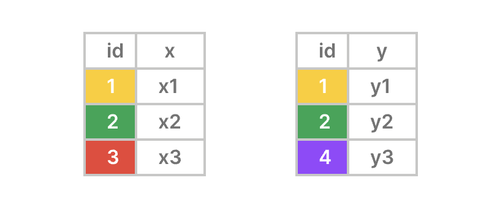
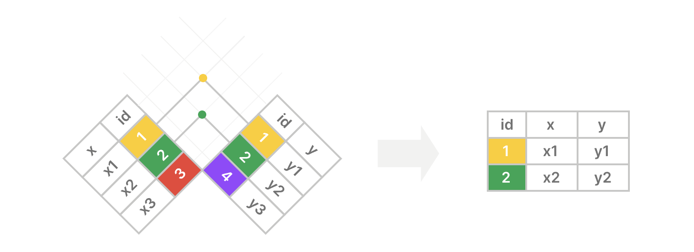
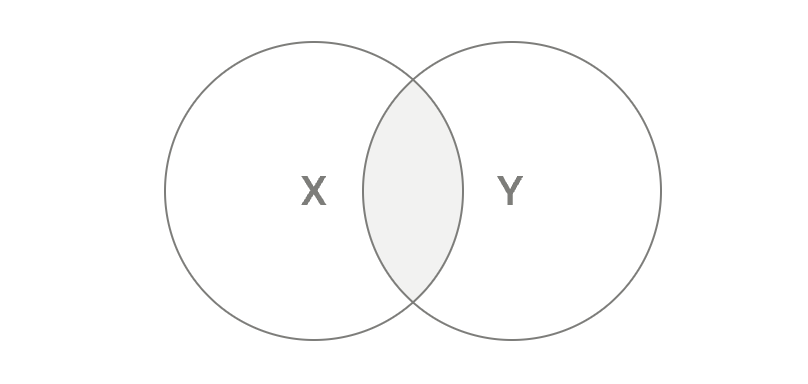

**摘要**: 在本教程中，你将学习如何使用 `PostgreSQL` 的 `INNER JOIN` 来合并两个表中的行并选择匹配的行。

# `PostgreSQL INNER JOIN` 简介

在 `PostgreSQL` 中，一个数据库由多个相关的表组成。它们通过 [`外键`](../第3节-使用表格数据/外键.md) 相互链接。

要从两个或多个表中选择数据，需使用 `SELECT` 语句的 `INNER JOIN` 子句。

以下是 `INNER JOIN` 语句的语法：

```sql
SELECT
  table1.column1,
  table2.column2,
  ...
FROM
  table1
  INNER JOIN table2 ON table1.column1 = table2.column1
```

在该语法中：

- 首先，在 `FROM` 子句中指定第一个表 `(table1)` 的名称。
- 其次，提供你希望在 `INNER JOIN` 子句中与第一个表合并行的第二个表 `(table2)`的名称。
- 第三，在 `ON` 子句中使用条件将第一个表 `(table1)` 中的行与第二个表 `table2` 中的行进行匹配。该条件通过比较 `table1` 中 `column1` 的值与 `table2` 中 `column1` 的值来匹配两个表中的行。请注意，该条件可以使用其他比较运算符。如果要使用多个条件，可以在 `ON` 子句中使用逻辑运算符`AND` 将它们组合起来。
- 最后，在 `SELECT` 子句中列出两个表中要包含在最终结果集中的列。

`PostgreSQL` 先计算 `FROM` 子句，然后计算 `INNER JOIN` 子句，最后计算 `SELECT` 子句。

以下是 `PostgreSQL` 内连接的工作原理：

- 首先，`INNER JOIN` 会比较两个表的 `column1` 中的值。
- 其次，如果中间表中的匹配行相等，则将它们合并。
- 第三，在最终结果集中选择 `SELECT` 子句中指定的列。

# 理解 `PostgreSQL` 内连接

假设你想使用内连接合并 `X` 表和 `Y` 表中的行：

- `X` 表有两列：`id` (键)和 `x`。
- `Y` 表也有两列：`id` (键) 和 `y`。



内连接包含在 `id` 列中具有匹配值的行。结果集中不包含不匹配的行：



以下维恩图是另一种描述内连接工作原理的方式：



# `PostgreSQL` 内连接示例

假设你有两个表：`products` 和 `brands` 。

```sql
CREATE TABLE brands (
  brand_id INT GENERATED ALWAYS AS IDENTITY PRIMARY KEY,
  name VARCHAR(255) NOT NULL
);

CREATE TABLE products (
  product_id INT GENERATED ALWAYS AS IDENTITY PRIMARY KEY,
  name VARCHAR(100) NOT NULL,
  price DECIMAL(10, 2) NOT NULL,
  brand_id INT,
  FOREIGN KEY (brand_id) REFERENCES brands (brand_id)
);

INSERT INTO
  brands (name)
VALUES
  ('Apple'),
  ('Samsung'),
  ('Google') 
RETURNING *;

INSERT INTO
  products (name, price, brand_id)
VALUES
  ('iPhone 14 Pro', 999.99, 1),
  ('iPhone 15 Pro', 1199.99, 1),
  ('Galaxy S23 Ultra', 1149.47, 2),
  ('Oppo Find Flip', 499.99, NULL) 
RETURNING *;
```

`products` 表有一个外键列 `brand_id` ，它链接到 `brands` 表的 `brand_id` 主键列：

`brands` 表：

| brand_id | name |
|:----:|:----:|
| 1 |  Apple |
| 2 | Samsung |
| 3 | Google |

`products` 表：

| product_id | name | price | brand_id |
|:----:|:----:|:----:|:----:|
|  1  | iPhone 14 Pro | 999.99 | 1 |
|  2  | iPhone 15 Pro | 1299.99 | 1 |
|  3  | Galaxy S23 Ultra | 1149.47 | 2 |
|  4  | Oppo Find Flip | 499.99 | NULL |

以下语句使用 `INNER JOIN` 从 `products` 表中选择产品名称和价格，并从 `brands` 表中选择品牌名称：

```sql
SELECT
  products.name,
  products.price,
  brands.name
FROM
  products
  INNER JOIN brands ON brands.brand_id = products.brand_id;
```

输出：

```sql
       name       |  price  |  name
------------------+---------+---------
 iPhone 14 Pro    |  999.99 | Apple
 iPhone 15 Pro    | 1199.99 | Apple
 Galaxy S23 Ultra | 1149.47 | Samsung
```

查询的工作原理。

首先，`FROM` 子句会检查来自 `products` 表的每一行。

其次，`INNER JOIN` 子句会将 `products` 表中每行的 `brand_id` 与 `brands` 表中每行的`brand_id` 进行比较。由于它们具有相同的 `brand_id` ，该查询会将两个表中的行合并成一个虚拟表：

| product_id | name | price | brand_id | brand_id | name |
|:----:|:----:|:----:|:----:|:----:|:----:|
|  1   | iPhone 14 Pro | 999.99 | 1 | 1 | Apple |
|  2   | iPhone 15 Pro | 1299.99 | 1 | 1 | Apple |
|  3   | Galaxy S23 Ultra | 1149.47 | 2 | 2 | Samsung |

更详细地说：

- `products` 表中 `id` 为 `1` 和 `2` 的行与 `brands` 表中 `id` 为 `1` 的行匹配。 
- `products` 表中 `id` 为 `3` 的行与 `brands` 表中 `id` 为 `2` 的行匹配。
- `products` 表中 `id` 为 `4` 的行与 `brands` 表中的任何行都不匹配。

第三，`SELECT` 子句从 `products` 表中选取 `name` 和 `price` 列，以及从 `brands` 表中选取`name` 列：

| name | price | name |
|:----:|:-----:|:----:|
| iPhone 14 Pro | 999.99 | Apple |
| iPhone 15 Pro | 1299.99 | Apple |
| Galaxy S23 Ultra | 1149.47 | Samsung |

# 限定列名 

由于表 `products` 和表 `brands` 都包含相同的 `name` 列和 `brand_id` 列，我们必须使用以下语法来引用它们：

```sql
table_name.column_name
```

如果不这样做，`PostgreSQL` 会抛出一个错误。例如：

```sql
SELECT
  name,
  price,
  name
FROM
  products
  INNER JOIN brands ON products.brand_id = products.brand_id;
```

错误：

```sql
column reference "name" is ambiguous
```

输出结果中有两列名称相同 `(name)` ；我们可以使用列别名使其更清晰：

```sql
SELECT
  products.name product_name,
  products.price,
  brands.name brand_name
FROM
  products
  INNER JOIN brands ON brands.brand_id = products.brand_id;
```

输出：

```sql
   product_name   |  price  | brand_name
------------------+---------+------------
 iPhone 14 Pro    |  999.99 | Apple
 iPhone 15 Pro    | 1199.99 | Apple
 Galaxy S23 Ultra | 1149.47 | Samsung
```

# 使用表别名连接表

为每一列输入相同的表名十分繁琐。`PostgreSQL` 支持在查询中使用表别名为表设置临时名称。

与列别名类似，您可以在查询执行期间使用以下语法为表临时分配一个别名：

```sql
table_name AS table_alias
```

由于 `AS` 关键字是可选的，因此你可以像这样忽略它：

```sql
table_name table_alias
```

以下语句使用表别名将 `products` 表与 `brands` 表连接起来：

```sql
SELECT
  p.name product_name,
  p.price,
  b.name brand_name
FROM
  products AS p
  INNER JOIN brands AS b ON b.brand_id = p.brand_id;
```

在这个示例中，我们将 `p` 指定为 `products` 表的表别名，将 `b` 指定为 `brands` 表的表别名。然后，我们使用这些表别名来引用两个表中的列名。

# `USING` 语法

如果使用等于运算符 `(=)` 通过比较相同列名的值来连接两个表，可以使用 `USING` 子句语法：

```sql
SELECT table1.column1, table2.column2, ...
FROM table1
INNER JOIN table2 USING (column1);
```

在这种语法中，我们替换以下 `ON` 子句：

```sql
ON table1.column1 = table2.column1
```

使用 `USING` 子句：

```sql
USING (column1)
```

例如，以下语句使用 `USING` 子句将 `products` 表与 `brands` 表连接起来：

```sql
SELECT
  p.name product_name,
  p.price,
  b.name brand_name
FROM
  products p
  INNER JOIN brands b USING (brand_id);
```

在本语句中，我们不使用 `AS` 关键字作为表的别名，而是使用 `USING` 子句来替代 `ON` 子句。

# 总结

- 使用 `INNER JOIN` 子句合并多个表中的行并选择匹配的行。
- 表别名是查询执行期间的临时表名。
- 当两个表具有相同的列名，且你希望基于这些列进行连接以简化语句时，请使用 `USING` 语法。

