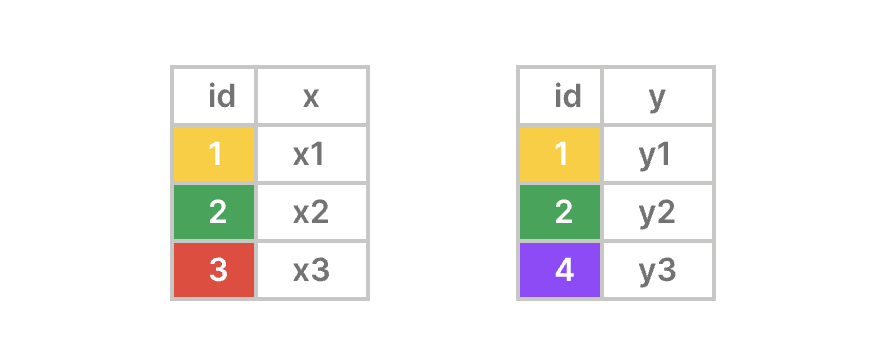
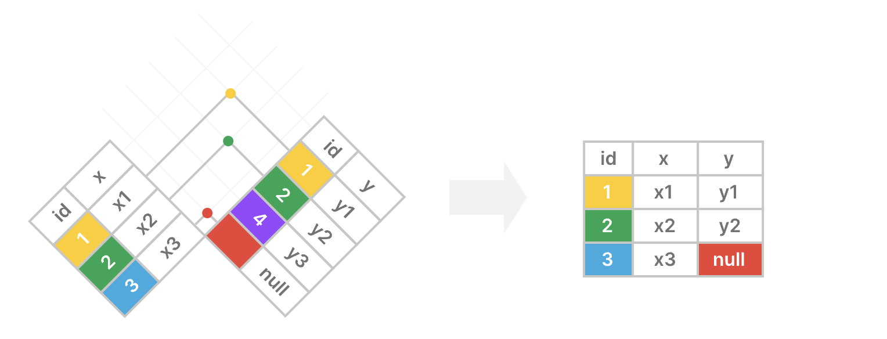
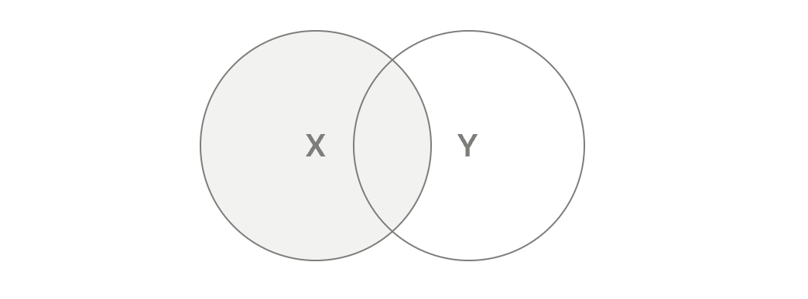

**摘要**：在本教程中，你将学习如何使用 `PostgreSQL` 的 `LEFT JOIN` 子句来合并两个表的行。

# `PostgreSQL LEFT JOIN` 简介

`LEFT JOIN` 是 `SELECT` 语句的一个可选子句。`LEFT JOIN` 用于合并两个表中的行，并返回左表中的所有行以及右表中与之匹配的行。

以下是 `LEFT JOIN` 子句的语法：

```sql
SELECT
  left_table.column1,
  right_table.column2,
  ...
FROM
  left_table
  LEFT JOIN right_table ON right_table.column1 = left_table.column1;
```

在该语法中：

首先，在 `FROM` 子句中指定左表 `(left_table)` 的名称：

```sql
FROM left_table
```

其次，提供在 `LEFT JOIN` 子句中与左表连接的右表的名称 `(right_table)`：

```sql
LEFT JOIN right_table
```

第三，在 `ON` 子句中使用条件将左表 `(left_table)` 中的行与右表 `(right_table)` 中的行进行匹配：

```sql
ON left_table.column1 = right_table.column1;
```

此条件通过比较左表 `(left_table)` 中 `column1` 的值与右表 `(right_table)` 中 `column1` 的值来匹配行：

```sql
right_table.column1 = left_table.column1;
```

`PostgreSQL` 始终会包含左表中的行以及右表中与之匹配的行。

如果左表中的一行在右表中没有匹配的行，`PostgreSQL` 会执行以下操作：

- 首先，用右表的列创建一个 "fake" 行。 
- 其次，用 `NULL` 填充所有列。
- 第三，将 "fake" 行与左表中的行合并。

最后，返回 `SELECT` 子句中指定的列：

```sql
SELECT
  left_table.column1,
  right_table.column2,
  ...
```

请注意，您在 `FROM` 子句是 `left` 表，而您在 `LEFT JOIN` 子句是右表。

# 理解 `PostgreSQL` 左连接

假设你想使用左连接合并来自 `X` 表和 `Y` 表的行：

- 这 `X` 表有两列： `id(key)` 和 `x`。
- `Y` 表也有两列：`id`(键)和 `y`。



左连接包含左表 `X` 中的所有行以及右表 `Y` 中的匹配行；如果左表中的某一行在右表中没有匹配项，左连接 `LEFT JOIN` 会对右表 `Y` 的列使用空值 `null` 。



以下维恩图是另一种描述左连接工作原理的方式：



# `PostgreSQL LEFT JOIN` 示例

让我们来看一个使用 `LEFT JOIN` 子句的例子。

## 设置示例表

假设我们有两个表 `brands` 和 `products`：

```sql
CREATE TABLE brands (
  brand_id INT GENERATED ALWAYS AS IDENTITY PRIMARY KEY,
  name VARCHAR(255) NOT NULL
);

CREATE TABLE products (
  product_id INT GENERATED ALWAYS AS IDENTITY PRIMARY KEY,
  name VARCHAR(100) NOT NULL,
  price DECIMAL(10, 2) NOT NULL,
  brand_id INT,
  FOREIGN KEY (brand_id) REFERENCES brands (brand_id)
);

INSERT INTO
  brands (name)
VALUES
  ('Apple'),
  ('Samsung'),
  ('Google') 
RETURNING *;

INSERT INTO
  products (name, price, brand_id)
VALUES
  ('iPhone 14 Pro', 999.99, 1),
  ('iPhone 15 Pro', 1199.99, 1),
  ('Galaxy S23 Ultra', 1149.47, 2),
  ('Oppo Find Flip', 499.99, NULL) 
RETURNING *;
```

`products` 表有一个外键列 `brand_id` ，它引用 `brands` 表的主键列 `brand_id`。

`brands` 表：

| brand_id | name |
|:----:|:----:|
| 1 | Apple |
| 2 | Samsung |
| 3 | Google |

`products` 表：

| product_id | name | price | brand_id |
|:----:|:----:|:----:|:----:|
| 1 | iPhone 14 Pro | 999.99 | 1 |
| 2 | iPhone 15 Pro | 1299.99 | 1 |
| 3 | Galaxy S23 Ultra | 1149.47 | 2 |
| 4 | Oppo Find Flip | 499.99 | NULL |

## 使用 `LEFT JOIN` 连接表

以下语句使用 `LEFT JOIN` 子句从 `brands` 表中选择所有行，并包含来自 `products` 表的匹配行： 

```sql
SELECT
  brands.name brand_name,
  products.name product_name,
  products.price
FROM
  brands
  LEFT JOIN products ON products.brand_id = brands.brand_id;
```

输出：

```sql
 brand_name |   product_name   |  price
------------+------------------+---------
 Apple      | iPhone 14 Pro    |  999.99
 Apple      | iPhone 15 Pro    | 1199.99
 Samsung    | Galaxy S23 Ultra | 1149.47
 Google     | NULL             |    NULL
```

工作原理。

首先，`FROM` 子句会检查 `brands` 表中的每一行。

其次，`LEFT JOIN` 子句会将 `brands` 表中每行的 `brand_id` 列的值与 `products` 表中每行的 `brand_id` 列的值进行比较。

如果它们相等，`PostgreSQL` 会合并两个表中的行。如果它们不相等，`PostgreSQL` 会创建一个新行，其中左表的列保持不变，右表的列则填充为 `NULL`。

`ID` 为 `1` 的品牌在 `products` 表中匹配到两行记录：

| brand_id | name | product_id | name | price | brand_id |
|:----:|:----:|:----:|:----:|:----:|:----:|
| 1 | Apple | 1 | iPhone 14 Pro | 999.99 | 1 |
| 2 | Apple | 2 | iPhone 15 Pro | 1299.99 | 1 |

`ID` 为 `2` 的品牌在 `products` 表中匹配到一行数据：

| brand_id | name | product_id | name | price | brand_id |
|:----:|:----:|:----:|:----:|:----:|:----:|
| 2 | Samsung | 3 | Galaxy S23 Ultra | 1149.47 | 2 |

`ID` 为 `3` 的品牌在 `products` 表中没有匹配的行。`PostgreSQL` 会为与 `products` 表中的列对应的所有列创建一个虚拟行，用 `NULL` 填充这些列，并与左表中的行进行合并：

| brand_id | name | product_id | name | price | brand_id |
|:----:|:----:|:----:|:----:|:----:|:----:|
| 1 | Apple | 1 | iPhone 14 Pro | 999.99 | 1 |
| 1 | Apple | 2 | iPhone 15 Pro | 1299.99 | 1 |
| 2 | Samsung | 3 | Galaxy S23 Ultra | 149.47 | 2 |
| 3 | Google | NULL | NULL | NULL | NULL |

查询 `brands` 和 `products` 表时，`PostgreSQL` 会产生以下中间结果：

| brand_id | name | product_id | name | price | brand_id |
|:----:|:----:|:----:|:----:|:----:|:----:|
| 1 | Apple | 1 | iPhone 14 Pro | 999.99 | 1 |
| 1 | Apple | 2 | iPhone 15 Pro | 1299.99 | 1 |
| 2 | Samsung | 3 | Galaxy S23 Ultra | 1149.47 | 2 |
| 3 | Google | NULL | NULL | NULL | NULL |

第三，返回 `SELECT` 语句中指定的列，并为它们赋予列别名：

| brand_name | product_name | price |
|:----:|:----:|:----:|
| Apple | 	iPhone 14 Pro | 999.99 |
| Apple | iPhone 15 Pro | 1299.99 |
| Samsung | Galaxy S23 Ultra | 1149.47 |
| Google | NULL | NULL |

# 使用表别名左连接表

表别名是在查询执行期间为表分配的临时名称。

以下语句将表别名用于 `brands` 和 `products` 表：

```sql
SELECT
  b.name AS brand_name,
  p.name AS product_name,
  p.price
FROM
  brands b
  LEFT JOIN products p ON p.brand_id = b.brand_id;
```

# `PostgreSQL` 的 `LEFT JOIN` 子句与 `USING` 语法

当使用等于运算符 `(=)` 通过比较相同列名的值来连接两个表时，可以使用 `USING` 子句语法：

```sql
SELECT
  left_table.column1,
  right_table.column2
FROM
  left_table
  LEFT JOIN right_table USING (column1);
```

在这条语句的左连接 `(LEFT JOIN)` 中，我们使用 `USING` 子句而非 `ON` 子句。

以下示例使用带有 `USING` 语法的 `LEFT JOIN` 子句将 `brands` 表与 `products` 表连接起来：

```sql
SELECT
  b.name brand_name
  p.name product_name,
  p.price
FROM
  brands b
  LEFT JOIN products p USING (brand_id);
```

# 总结

- 使用 `LEFT JOIN` 子句合并两个表中的行，并返回左表中的所有行以及右表中匹配的行。
- 当使用相同的列名和等于运算符对两个表进行左连接时，请使用 `USING` 语法。