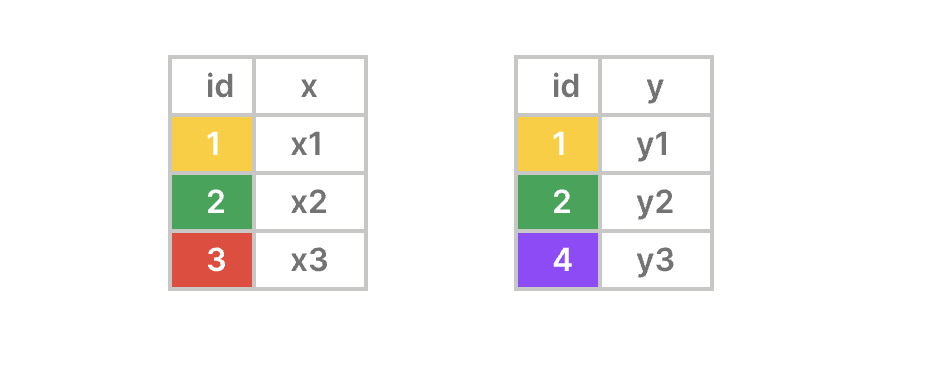
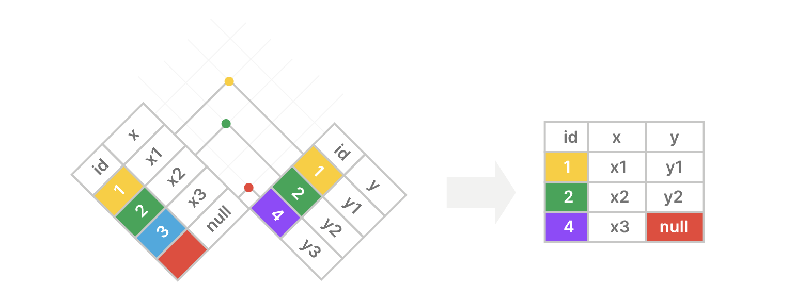
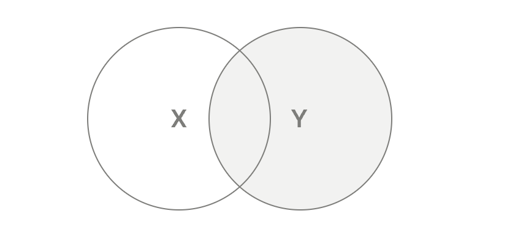

**摘要**: 在本教程中，您将学习如何使用 `PostgreSQL` 的 `RIGHT JOIN` 子句来合并两个表的行。

# `PostgreSQL RIGHT JOIN` 简介

`RIGHT JOIN` 允许你合并两个表中的行，并返回右表中的所有行，同时包含左表中匹配和不匹配的行。

以下是 `RIGHT JOIN` 的语法：

```sql
SELECT
  left_table.column1,
  right_table.column2,
  ...
FROM
  left_table
  RIGHT JOIN right_table ON right_table .column1 = left_table.column1;
```

在以下语法中：

首先，提供 `FROM` 子句中左表 `(left_table)` 的名称：

```sql
FROM left_table
```

其次，在 `RIGHT JOIN` 子句中指定要与左表连接的右表的名称 `(right_table)` ：

```sql
RIGHT JOIN right_table
```

第三，在 `ON` 子句中使用条件来匹配右表 `(left_table)` 中的行与左表 `(left_table)` 中的行

```sql
ON right_table.column1 = left_table.column1;
```

此条件通过比较右表 `(right_table)` 中 `column1` 的值与左表 `(left_table)` 中 `column1` 的值来匹配行。

`PostgreSQL` 始终包含右表中的行以及左表中匹配的行。匹配是指两个表中的行在 `column1` 列中具有相同的值。

如果右表中的一行在左表中没有匹配的行，`PostgreSQL` 会执行以下操作：

- 使用左表中的列创建一个 "fake" 行。
- 用 `NULL` 填充所有列
- 将 "fake" 行与右表中的行合并。

最后，在 `SELECT` 子句中指定要包含在最终结果集中的两个表的列：

```sql
SELECT
  left_table.column1,
  right_table.column2,
  ...
```

理解 `PostgreSQL` 右连接

假设你想要使用右连接合并来自 `X` 表和 `Y` 表的行：

- `X` 表有两列：`id` (键)和 `x` 。
- `Y` 表也有两列：`id`(键) 和 `y` 。



右连接包含右表 `(Y)` 中的所有行以及左表 `(X)` 中的匹配行。

如果右表中的某一行在左表中没有匹配的行 `(X)` ，则右连接会将左表的列 `(X)` 设为 `null`：



以下维恩图是另一种描述右连接工作原理的方式：



# `PostgreSQL RIGHT JOIN` 示例

假设我们有两个表 `brands` 和 `products`：

```sql
CREATE TABLE brands (
  brand_id INT GENERATED ALWAYS AS IDENTITY PRIMARY KEY,
  name VARCHAR(255) NOT NULL
);

CREATE TABLE products (
  product_id INT GENERATED ALWAYS AS IDENTITY PRIMARY KEY,
  name VARCHAR(100) NOT NULL,
  price DECIMAL(10, 2) NOT NULL,
  brand_id INT,
  FOREIGN KEY (brand_id) REFERENCES brands (brand_id)
);

INSERT INTO
  brands (name)
VALUES
  ('Apple'),
  ('Samsung'),
  ('Google') 
RETURNING *;

INSERT INTO
  products (name, price, brand_id)
VALUES
  ('iPhone 14 Pro', 999.99, 1),
  ('iPhone 15 Pro', 1199.99, 1),
  ('Galaxy S23 Ultra', 1149.47, 2),
  ('Oppo Find Flip', 499.99, NULL) 
RETURNING *;
```

`products` 表有一个外键列 `brand_id` ，它引用了 `brands` 表的 `brand_id` [`主键`](../第3节-使用表格数据/主键.md) 列。

`brands` 表：

| brand_id | name |
|:----:|:----:|
| 1 | Apple |
| 2 | Samsung |
| 3 | Google |

`products` 表：

| product_id | name | price | brand_id |
|:----:|:----:|:----:|:----:|
| 1  | iPhone 14 Pro | 999.99 | 1 |
| 2  | iPhone 15 Pro | 1299.99 | 1 |
| 3  | Galaxy S23 Ultra | 1149.47 | 2 |
| 4  | Oppo Find Flip | 499.99 | NULL |

以下语句使用 `RIGHT JOIN` 子句从 `brands` 表中选择所有行，并包含来自 `products` 表的匹配行：

```sql
SELECT
  brands.name AS brand_name,
  products.name AS product_name,
  products.price
FROM
  products
  RIGHT JOIN brands ON brands.brand_id = products.brand_id;
```

输出：

```sql
 brand_name |   product_name   |  price
------------+------------------+---------
 Apple      | iPhone 14 Pro    |  999.99
 Apple      | iPhone 15 Pro    | 1199.99
 Samsung    | Galaxy S23 Ultra | 1149.47
 Google     | NULL             |    NULL
```

工作原理。

首先，`FROM` 子句会检查 `brands` 表中的每一行。
其次，`RIGHT JOIN` 子句会将 `brands` 表中每行的 `brand_id` 列的值与 `products` 表中每行的`brand_id` 列的值进行比较。

如果它们相等，`PostgreSQL` 会合并两个表中的行。如果它们不相等，`PostgreSQL` 会创建一个新行，其中右表的列保持不变，左表的列则填充为 `NULL`。

`ID` 为 `1` 的品牌在 `products` 表中匹配到两行：

| brand_id | name | product_id | name | price | brand_id |
|:----:|:----:|:----:|:----:|:----:|:----:|
| 1 | Apple  | 1 | iPhone 14 Pro | 999.99 | 1 |
| 2 | Apple | 2 | iPhone 15 Pro | 1299.99 | 1 |

`ID` 为 `2` 的品牌与 `products` 表中的一行匹配：

| brand_id | name | product_id | name | price | brand_id |
|:----:|:----:|:----:|:----:|:----:|:----:|
| 2 | Samsung | 3 | Galaxy S23 Ultra | 1149.47 | 2 |

`ID` 为 `3` 的品牌与 `products` 表中的任何行都不匹配。`PostgreSQL` 会为与 `products` 表中的列对应的所有列创建一个虚拟行，用 `NULL` 填充这些列，并与 `brands` 表中的行进行合并：

| brand_id | name | product_id | name | price | brand_id |
|:----:|:----:|:----:|:----:|:----:|:----:|
| 1 | Apple | 1 | iPhone 14 Pro | 999.99 | 1 |
| 1 | Apple | 2 | iPhone 15 Pro | 1299.99 | 1 |
| 2 | Samsung | 3 |  Galaxy S23 Ultra | 1149.47 | 2 |
| 3 | Google | NULL | NULL | NULL | NULL |

在检查了 `brands` 表和 `products` 表中的所有行之后，`PostgreSQL` 得出了以下中间结果：

| brand_id | name | product_id | name | price | brand_id |
|:----:|:----:|:----:|:----:|:----:|:----:|
| 1 | Apple | 1 | iPhone 14 Pro | 999.99 | 1 |
| 1 | Apple | 2 | iPhone 15 Pro | 1299.99 | 1 |
| 2 | Samsung | 3 | Galaxy S23 Ultra | 1149.47 | 2 |
| 3 | Google | NULL | NULL | NULL | NULL |

第三，返回 `SELECT` 语句中指定的列：

| brand_name | product_name | price |
|:----:|:----:|:----:|
| Apple | iPhone 14 Pro | 999.99 |
| Apple | iPhone 15 Pro | 1299.99 |
| Samsung | Galaxy S23 Ultra | 1149.47 |
| Google | NULL | NULL |

# 使用表别名

表别名是在查询执行期间为表分配的临时名称。以下语句对 `brands` 表和 `products` 表使用了表别名：

```sql
SELECT
  b.name AS brand_name,
  p.name AS product_name,
  p.price
FROM
  products p
  RIGHT JOIN brands b ON b.brand_id = b.brand_id;
```

# 使用 `USING` 语法的 `PostgreSQL RIGHT JOIN` 子句

当使用等于运算符 `(=)` 通过比较相同列名的值来连接两个表时，可以使用 `USING` 子句语法：

```sql
SELECT
  left_table.column1,
  right_table.column2
FROM
  left_table
  RIGHT JOIN right_table USING (column1);
```

在本语句中，我们在 `RIGHT JOIN` 中使用了 `USING` 子句，而非 `ON` 子句。

以下示例使用带有 `USING` 语法的 `RIGHT JOIN` 子句将 `brands` 表与 `products` 表连接起来：

```sql
SELECT
  b.name brand_name,
  p.name product_name,
  p.price
FROM
  products p
  RIGHT JOIN brands b USING (brand_id);
```

# 总结

- 使用 `RIGHT JOIN` 子句合并两个表中的行，并返回右表中的所有行以及左表中与之匹配的行。
- 当使用相同的列名和等于运算符连接两个表时，请使用 `USING` 语法。

