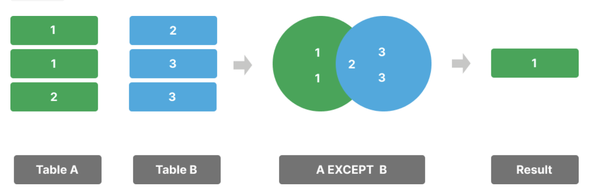
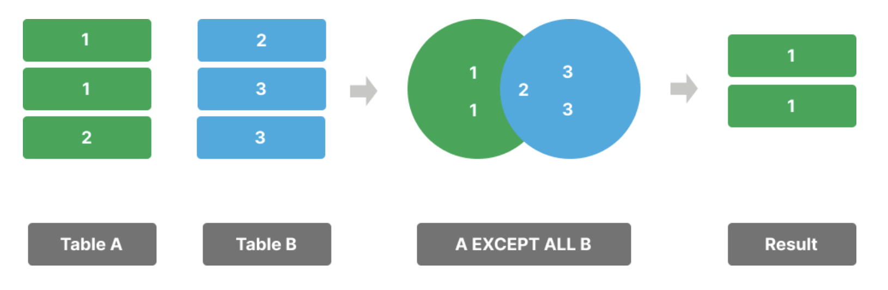

**摘要**：在本教程中，你将学习如何使用 `PostgreSQL` 的 `EXCEPT` 运算符来组合两个查询的结果集，并返回第一个查询中有而第二个查询中没有的记录。

# `PostgreSQL EXCEPT` 运算符入门

`EXCEPT` 运算符允许您组合两个查询并找出结果集之间的差异。

`EXCEPT` 运算符返回第一个结果集中不存在于第二个结果集中的行。

以下是 `EXCEPT` 运算符的语法：

```sql
SELECT column1, column2
FROM tableA
EXCEPT
SELECT column1, column2
FROM tableB;
```

在该语法中：
- 首先，指定两个你想要与其结果集合并的 `SELECT` 语句。
- 其次，在 `SELECT` 语句之间使用 `EXCEPT` 运算符，以找出查询结果集之间的差异。

要使 `EXCEPT` 运算符有效，`SELECT` 语句必须遵守以下规则：
- 它们必须返回具有相同列数的结果集。
- 相应列的数据类型必须兼容。

`EXCEPT` 运算符会从最终结果集中移除重复的行。



要在最终结果集中保留重复行，请使用 `EXCEPT ALL` 运算符：

```sql
SELECT column1, column2
FROM tableA
EXCEPT ALL
SELECT column1, column2
FROM tableB;
```



实际上，你会发现 `EXCEPT` 运算符在数据比较和分析中很有用。

# 创建示例表

假设你有两个表：

- `slow_movings` 表存储滞销产品。
- `flagships` 表存储旗舰产品。

以下是用于创建表并向其中插入一些行的SQL脚本：

```sql
CREATE TABLE slow_movings (
  id INT GENERATED ALWAYS AS IDENTITY PRIMARY KEY,
  name VARCHAR(255) NOT NULL,
  brand VARCHAR(50) NOT NULL
);

CREATE TABLE flagships (
  id INT GENERATED ALWAYS AS IDENTITY PRIMARY KEY,
  name VARCHAR(255) NOT NULL,
  brand VARCHAR(50) NOT NULL
);

INSERT INTO
  slow_movings (name, brand)
VALUES
  ('iPhone 16', 'Apple'),
  ('Galaxy S24', 'Samsung'),
  ('Pixel 9', 'Google'),
  ('iPhone 16 Plus', 'Apple'),
  ('Galaxy Z Flip 6', 'Samsung');

INSERT INTO
  flagships (name, brand)
VALUES
  ('iPhone 16', 'Apple'),
  ('Galaxy S24', 'Samsung'),
  ('Pixel 9', 'Google'),
  ('iPhone 16 Pro', 'Apple'),
  ('Galaxy S24 Ultra', 'Samsung');
```

# `PostgreSQL EXCEPT` 运算符示例

以下示例使用 `EXCEPT` 运算符来查找不是滞销产品的旗舰产品：

```sql
SELECT
  name,
  brand
FROM
  flagships
EXCEPT
SELECT
  name,
  brand
FROM
  slow_movings;
```

输出：

```sql
       name        |  brand
-------------------+---------
 iPhone 16 Pro Max | Apple
 Galaxy S24 Ultra  | Samsung
 iPhone 16 Pro     | Apple
```

与 `UNION` 和 `INTERSECT` 运算符不同，使用 `EXCEPT` 运算符时，`SELECT` 语句的顺序很重要，因为它会直接影响查询结果。

例如，以下查询调换了 `SELECT` 语句的顺序，以查找非旗舰产品的滞销产品：

```sql
SELECT
  name,
  brand
FROM
  slow_movings
EXCEPT
SELECT
  name,
  brand
FROM
  flagships;
```

输出：

```sql
      name       |  brand
-----------------+---------
 iPhone 16 Plus  | Apple
 Galaxy Z Flip 6 | Samsung
```

# 带有 `ORDER BY` 子句的 `PostgreSQL EXCEPT` 运算符

如果您想对 `EXCEPT` 运算符返回的结果集进行排序，可以在第二个 `SELECT` 语句中放置 `ORDER BY` 子句：

```sql
SELECT
  column1,
  column2
FROM
  table1
EXCEPT
SELECT
  column1,
  column2
FROM
  table2
ORDER BY
  sort_expression;
```

例如，以下语句会找出非滞销的旗舰产品，并按品牌对产品进行排序：

```sql
SELECT
  name,
  brand
FROM
  flagships
EXCEPT
SELECT
  name,
  brand
FROM
  slow_movings
ORDER BY
  brand;
```

输出：

```sql
       name        |  brand
-------------------+---------
 iPhone 16 Pro Max | Apple
 iPhone 16 Pro     | Apple
 Galaxy S24 Ultra  | Samsung
```

# 总结

- 使用 `PostgreSQL` 的 `EXCEPT` 运算符来找出两个结果集之间的差异。
- 使用 `PostgreSQL` 的 `EXCEPT ALL` 来在最终结果集中保留重复行。
- 将 `ORDER BY` 子句放在第二个 `SELECT` 语句中，以对结果集中的行进行排序。