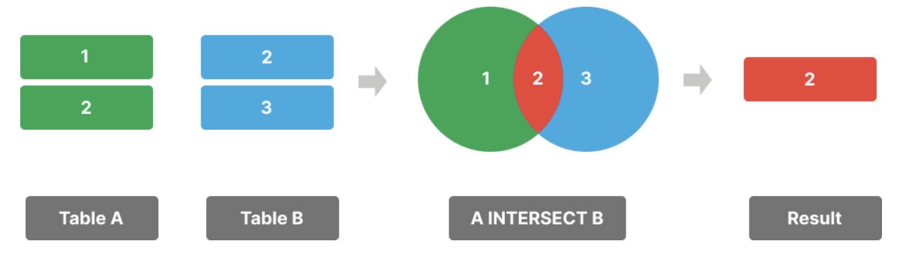
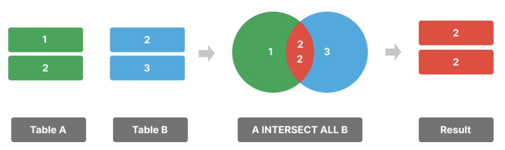

**摘要**：在本教程中，你将学习如何使用 `PostgreSQL` 的 `INTERSECT` 运算符来查找两个结果集中的共同记录。

# `PostgreSQL INTERSECT` 运算符入门

`INTERSECT` 运算符返回两个查询结果集的共同记录。换句话说，它返回两个结果集的交集。

以下是 `INTERSECT` 运算符的语法：

```sql
SELECT column1, column2 
FROM table1;
INTERSECT
SELECT column1, column2 
FROM table2;
```

在以下语法中：

- 首先，提供两个 `SELECT` 语句，以返回两个用于交集的结果集。
- 其次，在两个 `SELECT` 语句之间使用 `INTERSECT` 运算符，以找到两个结果集之间的交集。

两个 `SELECT` 语句都需要遵守以下规则：
- 结果集中的列数相同。
- 相应的列具有兼容的数据类型。

`INTERSECT` 运算符将包含两个查询中的不同行：



若要在结果中包含重复行，可以使用 `INTERSECT ALL` 运算符：

```sql
SELECT column1, column2
FROM tableA
INTERSECT ALL
SELECT column1, column2 
FROM tableB;
```



# 设置示例表

假设我们有两个表：`slow_movings` 和 `flagships`。

`slow_movings` 表存储滞销产品，`flagships` 表存储旗舰产品：

滞销品和旗舰产品

```sql
CREATE TABLE slow_movings (
    id INT GENERATED ALWAYS AS IDENTITY PRIMARY KEY,
    name VARCHAR(255) NOT NULL,
    brand VARCHAR(50) NOT NULL
);

CREATE TABLE flagships(
    id INT GENERATED ALWAYS AS IDENTITY PRIMARY KEY,
    name VARCHAR(255) NOT NULL,
    brand VARCHAR(50) NOT NULL
);

INSERT INTO slow_movings (name, brand) 
VALUES
('iPhone 16', 'Apple'),
('Galaxy S24', 'Samsung'),
('Pixel 9', 'Google'),
('iPhone 16 Plus','Apple'),
('Galaxy Z Flip 6', 'Samsung');

INSERT INTO flagships (name, brand) 
VALUES
('iPhone 16', 'Apple'),
('Galaxy S24','Samsung'),
('Pixel 9','Google'),
('iPhone 16 Pro', 'Apple'),
('Galaxy S24 Ultra','Samsung');
```

# `PostgreSQL INTERSECT` 运算符示例

以下语句使用 `INTERSECT` 运算符来查找滞销的旗舰产品：

```sql
SELECT
  name
FROM
  flagships
INTERSECT
SELECT
  name
FROM
  slow_movings;
```

输出：

```sql
    name
------------
 Pixel 9
 Galaxy S24
 iPhone 16
```

# 带有 `ORDER BY` 语句的 `PostgreSQL INTERSECT` 运算符

要对涉及 `INTERSECT` 运算符的查询的结果集进行排序，需将 `ORDER BY` 语句放在最后一个查询中：

```sql
SELECT
  column1,
  column2
FROM
  table1
INTERSECT
SELECT
  column1,
  column2
FROM
  table2
ORDER BY
  sort_expression;
```

例如，以下语句使用 `INTERSECT ALL` 运算符查找滞销的旗舰产品，并按名称对它们进行排序：

```sql
SELECT
  name
FROM
  flagships
INTERSECT
SELECT
  name
FROM
  slow_movings
ORDER BY name;
```

输出：

```sql
    name
------------
 Galaxy S24
 iPhone 16
 Pixel 9
```

# `PostgreSQL INTERSECT ALL` 运算符示例

以下语句使用 `INTERSECT` 运算符来查找滞销旗舰产品的品牌：

```sql
SELECT
  brand
FROM
  flagships
INTERSECT
SELECT
  brand
FROM
  slow_movings
ORDER BY brand;
```

输出：

```sql
  brand
---------
 Apple
 Google
 Samsung
```

它返回三个不同的品牌。

要查找所有品牌（包括重复的品牌），可以使用 `INTERSECT ALL` 运算符：

```sql
SELECT
  brand
FROM
  flagships
INTERSECT ALL
SELECT
  brand
FROM
  slow_movings
ORDER BY brand;
```

输出：

```sql
  brand
---------
 Apple
 Apple
 Google
 Samsung
 Samsung
```

# 总结

- 使用 `PostgreSQL` 的 `INTERSECT` 运算符返回两个结果集的交集。
- 使用 `INTERSECT ALL` 运算符来包含重复记录。
- 将 `ORDER BY` 子句放在最后一个查询中，以对 `INTERSECT` 运算符返回的最终结果集进行排序。

