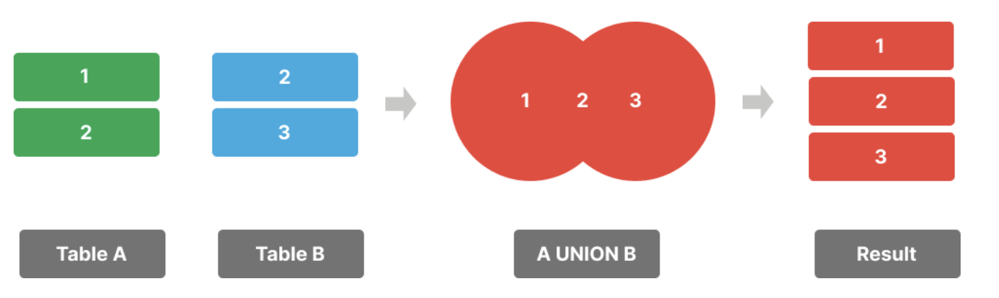
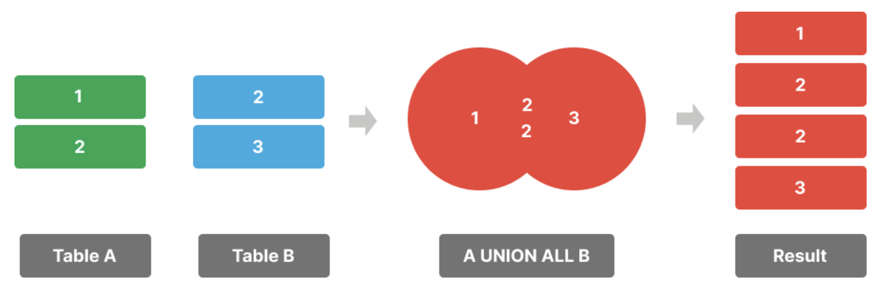

**摘要**：在本教程中，你将学习如何使用 `PostgreSQL` 的 `UNION` 运算符将两个查询的结果集合并为一个结果集。

# `PostgreSQL UNION` 运算符入门

`UNION` 运算符允许您将两个或多个查询的结果集合并为一个结果集。以下是 `UNION` 运算符的语法：

```sql
SELECT column1, column2 
FROM tableA;
UNION
SELECT column1, column2 
FROM tableB;
```

在以下语法中：

- 首先，提供两个你想要合并结果集的 `SELECT` 语句。
- 其次，在两个查询之间使用 `UNION` 关键字。

`UNION` 运算符将第二个 `SELECT` 语句的结果集附加到第一个 `SELECT` 语句的结果集。此外，它还会从最终结果集中删除重复的行：



两个 `SELECT` 语句都必须遵守以下规则：

- 返回相同数量的列。
- 相应列的列数据类型必须兼容。

# 设置示例表

 假设我们有两个表：

 - `slow_movings` 表存储滞销产品
 - `flagships` 表存储旗舰产品。

 `slow_movings` 表和 `flagships` 表：

 ```sql
 CREATE TABLE slow_movings (
  id INT GENERATED ALWAYS AS IDENTITY PRIMARY KEY,
  name VARCHAR(255) NOT NULL,
  brand VARCHAR(50) NOT NULL
);

CREATE TABLE flagships (
  id INT GENERATED ALWAYS AS IDENTITY PRIMARY KEY,
  name VARCHAR(255) NOT NULL,
  brand VARCHAR(50) NOT NULL
);

INSERT INTO
  slow_movings (name, brand)
VALUES
  ('iPhone 16', 'Apple'),
  ('Galaxy S24', 'Samsung'),
  ('Pixel 9', 'Google'),
  ('iPhone 16 Plus', 'Apple'),
  ('Galaxy Z Flip 6', 'Samsung');

INSERT INTO
  flagships (name, brand)
VALUES
  ('iPhone 16', 'Apple'),
  ('Galaxy S24', 'Samsung'),
  ('Pixel 9', 'Google'),
  ('iPhone 16 Pro', 'Apple'),
  ('Galaxy S24 Ultra', 'Samsung');
 ```

 # `PostgreSQL UNION` 运算符示例

 假设你想要获取所有旗舰产品和滞销产品的列表。

 你可以使用两个 `SELECT` 语句从 `slow_movings` 表和 `flagships` 表中检索数据。然后，使用 `UNION` 运算符将第二个查询的结果集附加到第一个查询的结果集中：

 ```sql
 SELECT
  name,
  brand
FROM
  slow_movings
UNION
SELECT
  name,
  brand
FROM
  flagships;
 ```

 输出：

 ```sql
        name       |  brand
------------------+---------
 iPhone 16        | Apple
 iPhone 16 Plus   | Apple
 Galaxy Z Flip 6  | Samsung
 Galaxy S24 Ultra | Samsung
 iPhone 16 Pro    | Apple
 Galaxy S24       | Samsung
 Pixel 9          | Google
 ```

 # 使用 `PostgreSQL` 的 `UNION` 与 `ORDER BY` 语句

 要对 `UNION` 运算符返回的结果集进行排序，可以使用 `ORDER BY` 子句。不过，你需要将 `ORDER BY` 语句放在第二个查询的末尾：

 ```sql
 SELECT column1, column2 
FROM tableA;
UNION
SELECT column1, column2 
FROM tableB
ORDER BY column1, column2;
 ```

 例如，以下语句使用 `UNION`  运算符组合员工和承包商的结果集，并使用 `ORDER BY` 子句按姓名对列表进行排序：

 ```sql
 SELECT
  name,
  brand
FROM
  slow_movings
UNION
SELECT
  name,
  brand
FROM
  flagships
ORDER BY name;
 ```

 输出：

 ```sql
        name       |  brand
------------------+---------
 Galaxy S24       | Samsung
 Galaxy S24 Ultra | Samsung
 Galaxy Z Flip 6  | Samsung
 iPhone 16        | Apple
 iPhone 16 Plus   | Apple
 iPhone 16 Pro    | Apple
 Pixel 9          | Google
 ```

 # 向结果集中添加列

 有时，你可能希望添加一个额外的列来标记一行数据来自哪个结果集。要实现这一点，你可以按如下方式指定固定值和列别名：

 ```sql
 SELECT
  column1,
  column2,
  value AS column3
FROM
  table1
UNION
SELECT
  column1,
  column2,
  value AS column3
FROM
  table2
ORDER BY
  sort_expression;
 ```

 例如，您可以按如下方式将 `inventory_type` 列添加到结果集中：

 ```sql
 SELECT
  name,
  brand,
  'Slow moving' inventory_type
FROM
  slow_movings
UNION
SELECT
  name,
  brand,
  'Flagship' inventory_type
FROM
  flagships
ORDER BY name;
 ```

 输出：

 ```sql
        name       |  brand  | inventory_type
------------------+---------+----------------
 Galaxy S24       | Samsung | Flagship
 Galaxy S24       | Samsung | Slow moving
 Galaxy S24 Ultra | Samsung | Flagship
 Galaxy Z Flip 6  | Samsung | Slow moving
 iPhone 16        | Apple   | Flagship
 iPhone 16        | Apple   | Slow moving
 iPhone 16 Plus   | Apple   | Slow moving
 iPhone 16 Pro    | Apple   | Flagship
 Pixel 9          | Google  | Flagship
 Pixel 9          | Google  | Slow moving
 ```

 # 使用 `UNION ALL` 运算符包含重复记录

 以下语句使用 `UNION` 运算符来合并旗舰产品和滞销产品的品牌名称：

 ```sql
 SELECT
  brand
FROM
  slow_movings
UNION
SELECT
  brand
FROM
  flagships
ORDER BY 
  brand;
 ```

 输出：

 ```sql
   brand
---------
 Apple
 Google
 Samsung
 ```

 最终的结果集中只包含三个不同的品牌名称。

 原因是 `UNION` 运算符会删除重复的品牌名称。要保留重复的行，可以使用 `UNION ALL` 运算符。

 # `PostgreSQL UNION ALL` 运算符

 `UNION ALL` 运算符将第二个查询的结果集附加到第一个查询的结果集，并在最终结果集中保留重复的行：

 ```sql
 SELECT column1, column2 
FROM tableA;
UNION ALL
SELECT column1, column2 
FROM tableB;
 ```



 例如，以下语句使用 `UNION ALL` 运算符来检索所有员工和承包商的姓名：

 ```sql
 SELECT
  brand
FROM
  slow_movings
UNION ALL
SELECT
  brand
FROM
  flagships
ORDER BY 
  brand;
 ```

 输出：

 ```sql
   brand
---------
 Apple
 Apple
 Apple
 Apple
 Google
 Google
 Samsung
 Samsung
 Samsung
 Samsung
 ```

 # 总结

 - 使用 `UNION` 运算符将一个查询的结果集附加到另一个查询的结果集，并在最终结果集中移除重复的行。
 - 使用 `UNION ALL` 运算符保留重复行
 - 将 `ORDER BY` 子句放在第二个查询的末尾，以对最终结果集中的行进行排序。